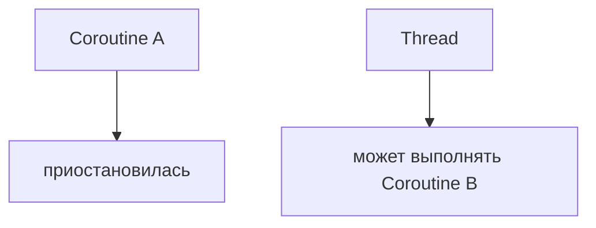
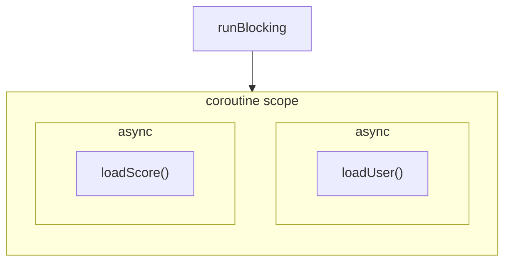

# Теория Корутин
#### Теория Kotlin: Часть 6

Теперь перейдём к одной из важнейших возможностей **Kotlin** — **корутинам**.

> **Корутина** — это приостанавливаемое вычисление, которое может приостановить своё 
> выполнение, не блокируя поток на время ожидания.

Корутины позволяют писать конкурентный код в стиле, похожем на обычный 
последовательный код. При этом корутина и поток — не одно и то же: множество 
корутин могут использовать меньше потоков, а приостановленная корутина освобождает 
поток для другой работы.

## Корутины и потоки

Важно различать:

- `Thread` - поток выполнения операционной системы
- `Coroutine` - лёгкая задача, которая может приостанавливаться

Корутина не является отдельным системным потоком.

Например, пока одна корутина ждёт данные:



При этом одна корутина может продолжить работу позже.

Это и есть одно из главных преимуществ механизма `suspension`.

## suspend

Основная конструкция корутин — функция с ключевым словом `suspend`:

```kotlin
suspend fun loadData() {
    // ...
}
```

`suspend` означает, что функция может приостановить выполнение.

Например:

```kotlin
import kotlinx.coroutines.delay

suspend fun loadData() {
    delay(1000)
    println("Data loaded")
}
```

`delay()` приостанавливает корутину, но не блокирует поток на время задержки.

### suspend не означает "новый поток"

Это очень важное различие.

```kotlin
suspend fun loadData()
```

не означает:

```text
создать новый поток
```

и не означает автоматически:

```text
выполнить код параллельно
```

`suspend` означает, что функция может участвовать в `suspension`-механизме 
**Kotlin**.

Сама по себе такая функция не создаёт новую корутину.

## kotlinx.coroutines

Основные высокоуровневые инструменты корутин находятся не в базовой 
стандартной библиотеке **Kotlin**, а в библиотеке `kotlinx.coroutines`.

Она предоставляет:

```text
launch
async
CoroutineScope
Dispatchers
Job
Deferred
delay
withContext
coroutineScope
```

и другие инструменты.

В **Gradle**-проект необходимо добавить соответствующую зависимость.

Например:

```kotlin
dependencies {
    implementation("org.jetbrains.kotlinx:kotlinx-coroutines-core:<version>")
}
```

Конкретную версию зависимости следует выбирать в соответствии с версией 
библиотеки и текущей документацией проекта; на момент подготовки этой части 
актуальный стабильный релиз `kotlinx.coroutines` — `1.11.0`.

## runBlocking

Самый простой способ запустить suspending-код из обычной функции:

```kotlin
import kotlinx.coroutines.runBlocking

fun main() = runBlocking {
    println("Hello")
}
```

`runBlocking` создаёт coroutine scope и блокирует **текущий поток** до 
завершения корутины.

Именно поэтому его удобно использовать как мост между обычным блокирующим 
кодом и suspending-кодом.

В приложениях не следует использовать `runBlocking` везде подряд. Это 
инструмент для мест, где действительно необходимо войти из blocking-кода 
в coroutine-код.

## launch

`launch` запускает новую корутину.

```kotlin
import kotlinx.coroutines.*

fun main() = runBlocking {
    launch {
        delay(1000)
        println("Coroutine finished")
    }

    println("Main continues")
}
```

Сначала выполняется:

```text
Main continues
```

а затем после задержки:

```text
Coroutine finished
```

`launch` возвращает объект типа `Job`, который представляет запущенную корутину.

## Job

Можно сохранить `Job` (задачу):

```kotlin
val job = launch {
    delay(1000)
    println("Done")
}
```

После этого можно дождаться завершения:

```kotlin
job.join()
```

Например:

```kotlin
fun main() = runBlocking {
    val job = launch {
        delay(5000)
        println("Done")
    }

    println("Waiting...")

    job.join()

    println("Finished")
}
```

```kotlin
Waiting... 
// 5 секунд выполняется задача и после:
Done
Finished
```

## async

`async` используется, когда корутина должна вернуть результат.

```kotlin
val deferred = async {
    10 + 20
}
```

Результат имеет тип:

```text
Deferred<Int>
```

Получить значение можно через:

```kotlin
deferred.await()
```

Например:

```kotlin
fun main() = runBlocking {
    val result = async {
        10 + 20
    }

    println(result.await())
}
```

`Deferred` представляет будущее значение и является разновидностью `Job`.

### launch или async?

Упрощённо:

- `launch` - запустить работу — конкретный результат не нужен
- `async` - запустить вычисление — результат нужен позже

Например:

```kotlin
launch {
    saveData()
}
```

и:

```kotlin
val result = async {
    loadData()
}
```

### Параллельное выполнение нескольких async

Рассмотрим:

```kotlin
val first = async {
    loadFirst()
}

val second = async {
    loadSecond()
}
```

Обе операции запускаются в рамках одной `coroutine scope`.

Потом:

```kotlin
val result1 = first.await()
val result2 = second.await()
```

Так можно выполнять независимые операции конкурентно и затем дождаться 
их результатов.

## CoroutineScope

Корутины не должны существовать бесконтрольно.

Они запускаются внутри `CoroutineScope`, который определяет их жизненный 
цикл и контекст выполнения.

Например:

```kotlin
suspend fun load() = coroutineScope {
    launch {
        // ...
    }

    launch {
        // ...
    }
}
```

`CoroutineScope` связывает дочерние корутины с родительской задачей.

### Structured concurrency

**Kotlin coroutines** строятся вокруг принципа **structured concurrency**.

Корутины образуют иерархию:

```text
Parent
├── Child 1
├── Child 2
└── Child 3
```

Жизненный цикл дочерних корутин связан с родительской корутиной.

Родительский `scope` ожидает завершения дочерних корутин, а отмена 
родительской корутины распространяется на дочерние.

Это делает управление жизненным циклом и ошибками более предсказуемым.

### coroutineScope

Например:

```kotlin
suspend fun loadEverything() = coroutineScope {
    launch {
        loadUsers()
    }

    launch {
        loadProducts()
    }
}
```

Функция `loadEverything()` не завершится, пока дочерние корутины не завершатся.

Так строится **structured concurrency**.

### Почему не стоит использовать `GlobalScope`

Иногда можно встретить:

```kotlin
GlobalScope.launch {
    // ...
}
```

Такую корутину сложно связать с жизненным циклом конкретной операции.

Вместо этого обычно предпочтительнее запускать корутины в подходящем 
`CoroutineScope`.

Именно structured concurrency позволяет автоматически связывать жизненный 
цикл дочерних задач с родителем.

## Dispatchers

**Coroutine context** может содержать `CoroutineDispatcher`.

`Dispatcher` определяет, где корутина будет выполняться — например, используя 
определённый поток или пул потоков.

Наиболее часто встречаются:

```text
Dispatchers.Default
Dispatchers.IO
Dispatchers.Main
```

`Dispatchers.Default` — предназначен прежде всего для CPU-интенсивной работы.

`Dispatchers.IO` — обычно используют для блокирующих операций ввода/вывода.

`Dispatchers.Main` — применяется в средах, где существует главный UI-поток, 
например в Android-приложениях.

### Dispatchers.Default

Например:

```kotlin
launch(Dispatchers.Default) {
    val result = calculateSomething()
    println(result)
}
```

`Default` использует общий пул потоков для фоновой работы и хорошо подходит 
для вычислений, которые нагружают процессор.

### Dispatchers.IO

Для операций, связанных с блокирующим вводом/выводом, обычно используется:

```kotlin
withContext(Dispatchers.IO) {
    // работа с файлами
}
```

Это позволяет не выполнять потенциально блокирующую операцию в контексте, 
предназначенном для CPU-bound работы.

Важно:

> `Dispatchers.IO` не делает произвольную функцию автоматически асинхронной. 
> Он меняет контекст выполнения блока.

### withContext

`withContext` позволяет временно изменить coroutine context:

```kotlin
suspend fun loadFile(): String {
    return withContext(Dispatchers.IO) {
        // чтение файла
        "data"
    }
}
```

После завершения блока выполнение возвращается в исходный контекст.

`withContext` часто используется для переключения между разными типами работы.

## Suspension и blocking

Это одно из самых важных различий при изучении корутин.

### Blocking

```kotlin
Thread.sleep(1000)
```

Блокирует поток.

Пока выполняется `sleep`, поток не может использоваться для другой работы.

### Suspending

```kotlin
delay(1000)
```

Приостанавливает корутину, но не блокирует поток.

Поэтому:

- `Thread.sleep()` - блокирует `thread`
- `delay()` - приостанавливает `coroutine`

Это фундаментальная идея корутин.

## Отмена корутины

Корутина имеет жизненный цикл и может быть отменена.

Например:

```kotlin
fun main() = runBlocking {
    val job = launch {
        repeat(10) { i ->
            println(i)
            delay(500)
        }
    }

    delay(1200)
    job.cancel()
}
```

Через некоторое время `job` будет отменён.

Отмена в coroutines является кооперативной: корутина должна достигать 
точек, в которых может обработать отмену, например `delay`, либо 
самостоятельно проверять состояние отмены.

### isActive

В долгих вычислениях можно самостоятельно проверить, не отменена ли корутина:

```kotlin
launch {
    while (isActive) {
        doWork()
    }
}
```

Когда корутина отменяется:

`isActive` — `false`

и цикл должен завершиться.

### join

`join()` позволяет дождаться завершения `Job`:

```kotlin
val job = launch {
    doWork()
}

job.join()
```

После `join()` выполнение продолжится после завершения корутины.

## Обработка исключений

Корутины имеют собственную модель распространения исключений.

Например, исключение внутри `launch` может привести к отмене родительской 
корутины и других дочерних корутин в соответствующей структурированной иерархии.

`launch` и `async` по-разному предоставляют ошибки вызывающему коду: для 
`async` исключение обычно становится доступным при `await()`, а `launch` 
распространяет необработанное исключение, как исключение корутины.

Простейший пример:

```kotlin
fun main() = runBlocking {
    try {
        val result = async {
            error("Something went wrong")
        }

        result.await()
    } catch (e: Exception) {
        println("Ошибка: ${e.message}")
    }
}
```

### try-catch и корутины

Обычный `try-catch` продолжает работать:

```kotlin
launch {
    try {
        doSomething()
    } catch (e: Exception) {
        println("Ошибка")
    }
}
```

Но важно учитывать структуру родительских и дочерних корутин.

В частности, обычное исключение дочерней корутины может отменить 
родителя и других дочерних задач. Для независимых задач существует, 
например, `supervisorScope`, который изменяет правила распространения 
отказов между детьми.

### supervisorScope

Иногда необходимо, чтобы ошибка одной дочерней корутины не отменяла остальные.

Для этого существует:

```kotlin
supervisorScope
```

Например:

```kotlin
suspend fun loadData() = supervisorScope {
    launch {
        println("Task 1")
        error("Task 1 failed")
    }

    launch {
        println("Task 2")
        delay(1000)
        println("Task 2 finished")
    }
}
```

Здесь задачи находятся под supervisor scope, который изменяет 
стандартное распространение отказов между дочерними корутинами.

На начальном этапе достаточно понимать саму идею:

- `coroutineScope` — ошибка ребёнка может отменить родителя и соседние задачи
- `supervisorScope` — дочерние задачи могут быть изолированы друг от друга

## Полный небольшой пример

Объединим основные понятия:

```kotlin
import kotlinx.coroutines.*
import kotlin.time.Duration.Companion.seconds

suspend fun loadUser(): String {
    delay(1.seconds)
    return "Alex"
}

suspend fun loadScore(): Int {
    delay(2.seconds)
    return 100
}

fun main() = runBlocking {
    val user = async {
        loadUser()
    }

    val score = async {
        loadScore()
    }

    println("User: ${user.await()}")
    println("Score: ${score.await()}")
}
```

Здесь:



Обе операции запускаются конкурентно, а `await()` получает их результаты.

## Важная модель корутин

Полезно разделять несколько понятий:

- `suspend` - функция может приостанавливать выполнение
- `CoroutineScope` - владелец жизненного цикла корутин
- `launch` - корутина без отдельного результата
- `async` - корутина с результатом Deferred
- `Job` - управление жизненным циклом корутины
- `Dispatcher` - определяет, где выполняется корутина
- `withContext` - выполнение блока в другом контексте
- `structured concurrency` - связывает parent и child coroutines

Эти понятия часто встречаются вместе, но это разные вещи.