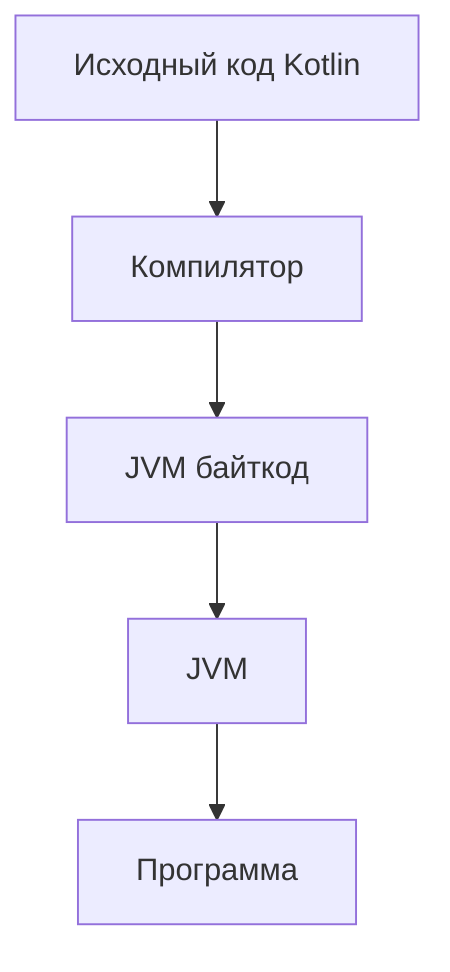

# Теория Kotlin: Часть 1

**Kotlin** — статически типизированный язык программирования, разработанный 
компанией JetBrains.

**Kotlin** можно использовать для разработки приложений под разные платформы. 
В этой методичке мы будем в основном рассматривать **Kotlin/JVM**, то есть 
**Kotlin**, который запускается на виртуальной машине **Java** (**JVM**).

Простейшая программа на **Kotlin** выглядит так:

<iframe src="https://pl.kotl.in/caPUI4rSz" height=256></iframe>

## main() — точка входа

`fun main()` — точка входа в программу. Именно с неё начинается выполнение программы.

```kotlin
fun main() {
    println("Hello, Kotlin!")
}
```

В **Java** аналогичная точка входа выглядит следующим образом:

```java
public static void main(String[] args) {
    System.out.println("Hello, Java!");
}
```

В **Kotlin** не требуется помещать `main()` внутрь класса.

Кроме того, функции и классы можно объявлять непосредственно на верхнем уровне файла:

```kotlin
fun greet() {
    println("Hello!")
}

class User(
    val name: String
)

fun main() {
    greet()
    val user = User("Alex")
    println(user.name)
}
```

## Файлы .kt

Обычный исходный код **Kotlin** хранится в файлах с расширением `.kt`:

```
Main.kt
User.kt
Calculator.kt
```

Файл `.kt` может содержать несколько функций и классов верхнего уровня.

Например:

```kotlin
fun sum(a: Int, b: Int): Int {
    return a + b
}

class User(
    val name: String
)

fun main() {
    println(sum(2, 3))
}
```

При этом необязательно, чтобы имя файла совпадало с именем класса или функции.

Например, файл `Main.kt` может содержать:

```kotlin
class User
class Product

fun hello() {
    println("Hello")
}

fun main() {
    hello()
}
```

## Файлы .kts

Помимо `.kt`, в **Kotlin** существуют файлы с расширением `.kts`.

`.kts` означает **Kotlin Script**.

В скрипте код может находиться непосредственно на верхнем уровне:

```kotlin
val name = "Alex"

println("Hello, $name!")
```

В обычном `.kt` файле программа обычно содержит `main()`:

```kotlin
fun main() {
    val name = "Alex"
    println("Hello, $name!")
}
```

В рамках этой методички основные программы и практические задания будем
писать в обычных файлах `.kt`.

## Как запускается код на Kotlin

Упрощённо процесс можно представить следующим образом:



При использовании **Kotlin/JVM** исходный код **Kotlin** компилируется в байткод **JVM**.

Этот байткод затем выполняется виртуальной машиной **Java** — **JVM** (Java Virtual Machine).

На практике способ запуска зависит от используемой среды: IDE, командной строки, Gradle и т.д.

Для изучения небольших конструкций **Kotlin** удобно использовать **Kotlin Playground**.

Но **Playground** не поддерживает полноценный интерактивный ввод из консоли, 
поэтому лучше создавать локальный проект **Kotlin** в **IDE**. 
В методичке **Playground** используется для запуска небольших фрагментов кода.

## Комментарии

Комментарии используются для пояснения кода и не выполняются программой.

### Однострочный комментарий

Для однострочного комментария используется //:

```kotlin
// Это комментарий

println("Hello")
```

### Многострочный комментарий

Для многострочного комментария используются /* и */:

```kotlin
/*
    Это многострочный
    комментарий
*/

println("Hello")
```

Комментарии помогают объяснять сложный код, но не должны заменять понятный код.

## Переменные

В **Kotlin** для объявления переменной используются ключевые слова `val` и `var`.


### val

`val` (value) — read-only переменная, которую нельзя переприсвоить после инициализации.

```kotlin
val name = "Anna"
// name = "Maria"  // нельзя
```

При этом важно понимать, что `val` запрещает именно переприсваивание переменной. 
Если переменная содержит ссылку на изменяемый объект (`Mutable`), сам объект может 
изменяться:

```kotlin
val numbers = mutableListOf(1, 2)

numbers.add(3) // можно
```

Но переприсвоить `numbers` нельзя:

```kotlin
// numbers = mutableListOf(4, 5) // ошибка
```

### var

`var` (variable) — изменяемая переменная, значение можно менять
многократно.

```kotlin
var age = 25 
age = 26 
age = 27
```

### Хороший тон

Предпочитайте `val` во всех случаях, когда переменная не должна
меняться. Это делает код безопаснее и понятнее.

## Типы данных

**Kotlin** — статически типизированный язык.

Это означает, что каждая переменная имеет определённый тип.

Тип можно указать явно:

```kotlin
val name: String = "Anna" 
val age: Int = 25
```

Однако в большинстве случаев **Kotlin** умеет самостоятельно определить 
тип по значению. Это называется выводом типов (`type inference`):

```kotlin
val name = "Anna"   // String
val age = 25        // Int
val price = 19.99   // Double
```

Если тип очевиден из значения, обычно нет необходимости указывать его явно.

Тип особенно полезно указывать, когда переменная объявляется без начального значения:

```kotlin
val message: String
message = "Hello"
```

## Основные типы

Для начала достаточно познакомиться со следующими типами:

| Тип       | Размер (бит) | Пример значения  | Назначение               |
|-----------|--------------|------------------|--------------------------|
| `Byte`    | 8            | `127`            | маленькие целые числа    |
| `Short`   | 16           | `32000`          | целые числа              |
| `Int`     | 32           | `2_147_483_647`  | целые числа              |
| `Long`    | 64           | `1_000_000_000L` | большие целые числа      |
| `Float`   | 32           | `3.14f`          | числа с плавающей точкой |
| `Double`  | 64           | `3.14`           | числа с плавающей точкой |
| `Char`    | 16           | `'Z'`            | один символ              |
| `Boolean` | 8            | `true`           | логическое значение      |
| `String`  | динамичный   | `"Hello"`        | строка                   |

### Целые числа

Наиболее часто используется `Int`:

```kotlin
val age: Int = 25
```

Для больших целых чисел используется Long:

```kotlin
val population: Long = 8_000_000_000L
```

В **Kotlin** можно использовать символ `_` для удобства чтения больших чисел:

```kotlin
val number = 1_000_000
```

### Числа с плавающей точкой

Для дробных чисел чаще всего используется `Double`:

```kotlin
val price = 19.99
```

`Float` обозначается суффиксом `f`:

```kotlin
val temperature = 36.6f
```

По умолчанию:

```kotlin
val number = 10      // Int
val price = 10.5     // Double
```

### Char

`Char` хранит один символ.

Символ записывается в одинарных кавычках:

```kotlin
val letter: Char = 'A'
```

Нельзя записать строку из нескольких символов в `Char`:

```kotlin
// val letter: Char = "ABC" // ошибка
```

Для текста используется `String`.

### Boolean

`Boolean` может иметь только два значения `true` и `false`.

Например:

```kotlin
val isStudent = true
val isAdmin = false
```

`Boolean` часто используется в условиях:

```kotlin
if (isStudent) {
    println("Студент")
}
```

## Приведение типов

В **Kotlin** нет неявного расширяющего приведения чисел, как в **Java**.
Вместо этого нужно явно вызывать методы `toByte()`, `toShort()`, `toInt()`,
`toLong()`, `toFloat()`, `toDouble()`.

```kotlin
val count: Int = 10 
val bigCount: Long = count.toLong() // Явное приведение 

val grade: Double = 95.7 
val rounded: Int = grade.toInt()
```

**Kotlin** не делает неявное преобразование при присваивании и передаче аргументов:

```kotlin
val a: Int = 10
val b: Long = a.toLong()
```

Но в арифметических выражениях разные числовые типы могут участвовать вместе, 
и тип результата определяется компилятором:

```kotlin
val a: Int = 10
val b: Long = 20L

val result = a + b // Long
```

## Строки

Строки представлены типом `String`.

```kotlin
val name = "Kotlin"
```

Строка может содержать любое количество символов:

```kotlin
val message = "Hello, Kotlin!"
```

Отдельный символ можно получить по индексу:

```kotlin
val word = "Kotlin"

println(word[0]) // K
println(word[1]) // o
```

Индексация начинается с 0.

```
K o t l i n
0 1 2 3 4 5
```

### Обычные строки

Обычные строки записываются в двойных кавычках:

```kotlin
val message = "Hello, Kotlin!"
```

В них можно использовать `escape`-последовательности:

```kotlin
val text = "Hello\nWorld"
```

Результат:

```
Hello
World
```

Некоторые часто используемые последовательности:

```
\n  новая строка
\t  табуляция
\"  двойная кавычка
\\  обратный слеш
```

### Многострочные строки

Для многострочных строк используются тройные кавычки:

```kotlin
val text = """
    Первая строка
    Вторая строка
    Третья строка
""".trimIndent()

println(text)
```

Многострочные строки удобны, когда необходимо сохранить несколько строк текста.

<iframe src="https://pl.kotl.in/Wx7e-Bcph" height="370"></iframe>

### Шаблонные выражения

В строку можно подставлять значения переменных с помощью `$`:

```kotlin
val name = "Alex"

println("Hello, $name!")
```

Результат:

```
Hello, Alex!
```

Можно вычислять выражения, используя `${}`:

```kotlin
val age = 25

println("Через год будет ${age + 1}")
```

Результат:

```
Через год будет 26
```

<iframe src="https://pl.kotl.in/YGY_Vjio6"></iframe>

## Ввод и вывод

Для взаимодействия с пользователем программа может выводить информацию 
в консоль и получать данные от пользователя.

### println()

`println()` выводит значение и переводит курсор на новую строку:

```kotlin
println("Hello")
println("World")
```

Результат:

```
Hello
World
```

### print()

`print()` выводит значение без перехода на новую строку:

```kotlin
print("Hello ")
print("World")
```

Результат:

```
Hello World
```

Это удобно использовать перед вводом:

```kotlin
print("Введите имя: ")
```

### readln()

Для чтения строки из консоли используется:

```kotlin
readln()
```

Например:

```kotlin
fun main() {
    print("Введите имя: ")

    val name = readln()

    println("Привет, $name!")
}
```

Если пользователь введёт:

```
Alex
```

программа выведет:

```
Привет, Alex!
```

### Ввод чисел

`readln()` возвращает `String`.

Поэтому для получения числа необходимо преобразовать введённую строку:

```kotlin
val age = readln().toInt()
```

Например:

```kotlin
fun main() {
    print("Введите возраст: ")

    val age = readln().toInt()

    println("Ваш возраст: $age")
}
```

Для других числовых типов используются соответствующие функции:

```kotlin
val number = readln().toInt() // Int
val bigNumber = readln().toLong() // Long
val price = readln().toDouble() // Double
```

## Операторы

### Арифметические операторы

Основные арифметические операторы:

| Арифметические операторы |                    |
|--------------------------|--------------------|
| `+`                      | сложение           |
| `-`                      | вычитание          |
| `*`                      | умножение          |
| `/`                      | деление            |
| `%`                      | остаток от деления |

Пример:

```kotlin
val a = 10
val b = 3

println(a + b) // 13
println(a - b) // 7
println(a * b) // 30
println(a / b) // 3
println(a % b) // 1
```

Обратите внимание на деление целых чисел:

```kotlin
val result = 5 / 2

println(result) // 2
```

Так происходит потому, что оба операнда имеют целочисленный тип.

Если требуется получить дробный результат:

```kotlin
val result = 5.0 / 2

println(result) // 2.5
```

### Операторы сравнения

Для сравнения значений используются:

| Операторы сравнения |                  |
|---------------------|------------------|
| `==`                | равно            |
| `!=`                | не равно         |
| `>`                 | больше           |
| `<`                 | меньше           |
| `>=`                | больше или равно |
| `<=`                | меньше или равно |

Например:

```kotlin
val age = 20

println(age >= 18) // true
println(age < 18)  // false
```

Результатом сравнения является `Boolean`.

### Логические операторы

| Основные логические операторы |     |
|-------------------------------|-----|
| &&                            | И   |
| `\|\|`                        | ИЛИ |
| !                             | НЕ  |


Например:

```kotlin
val age = 25

val result = age >= 18 && age <= 60

println(result) // true
```

## Условные операторы

### if

`if` позволяет выполнить код в зависимости от условия.

```kotlin
val age = 20

if (age >= 18) {
    println("Совершеннолетний")
}
```

Если условие истинно, выполняется код внутри фигурных скобок.

### if-else

Если необходимо предусмотреть два варианта:

```kotlin
val age = 16

if (age >= 18) {
    println("Совершеннолетний")
} else {
    println("Несовершеннолетний")
}
```

### if как выражение

В **Kotlin** `if` является выражением, поэтому его результат можно сохранить в 
переменную:

```kotlin
val age = 20

val status = if (age >= 18) {
    "Совершеннолетний"
} else {
    "Несовершеннолетний"
}

println(status)
```

Отдельного тернарного оператора, как в некоторых других языках, в **Kotlin** нет.

Вместо него обычно используется `if` как выражение:

```kotlin
val result = if (condition) "Да" else "Нет"
```

### when

`when` используется для выбора одного из нескольких вариантов.

Он похож на `switch` из **Java** и других языков, но возможности `when` шире.

Например:

```kotlin
val number = 2

when (number) {
    1 -> println("Один")
    2 -> println("Два")
    3 -> println("Три")
    else -> println("Другое число")
}
```

### when как выражение

Как и `if`, `when` может возвращать значение:

<iframe src="https://pl.kotl.in/2prEpAXRi"></iframe>

### Несколько значений в одной ветке 

Можно объединять значения через запятую:

```kotlin
val number = 2

when (number) {
    1, 2, 3 -> println("Маленькое число")
    4, 5, 6 -> println("Среднее число")
    else -> println("Другое число")
}
```

### Диапазоны в when

`when` может использовать диапазоны:

<iframe src="https://pl.kotl.in/SfMolU6MY"></iframe>

## Диапазоны

Диапазон создаётся оператором `..` и представляет последовательность
значений от начального до конечного включительно.

Существуют также `until` (исключая конец), `downTo`, `step` (только положительный).

```kotlin
val range = 1..10          // 1,2,...,10 
val halfOpen = 0 until 10  // 0,1,...,9 
val chars = 'a'..'z'       // Диапазон символов 
val reverseEven = 10 downTo 0 step 2 // 10,8,6,4,2,0
```

Проверка принадлежности выполняется оператором `in`.

<iframe src="https://pl.kotl.in/10gVdHFkF"></iframe>

## Циклы
 
Циклы позволяют повторять выполнение кода.

В **Kotlin** используются `for`, `while`, `do-while`.

### for

Используется для итерации по любому объекту, предоставляющему итератор. 
Чаще всего применяется с диапазонами (`..`), коллекциями, массивами.

<iframe src="https://pl.kotl.in/8mS_mTc1m" height=240></iframe>

Можно перебирать символы строки:

```kotlin
for (letter in "Kotlin") {
    println(letter)
}
```

### while

`while` выполняет код до тех пор, пока условие истинно.

```kotlin
var i = 1

while (i <= 5) {
    println(i)
    i++
}
```

Результат:

```
1
2
3
4
5
```

Здесь `i++` увеличивает значение `i` на единицу.

Будьте внимательны: если условие никогда не станет `false`, цикл может 
выполняться бесконечно.

### do-while

`do-while` похож на `while`, но сначала выполняет тело цикла, а уже 
затем проверяет условие:

```kotlin
var i = 1

do {
    println(i)
    i++
} while (i <= 5)
```

Главное отличие:

`while` → сначала проверяет условие → затем выполняет тело

`do-while` → сначала выполняет тело → затем проверяет условие

Поэтому `do-while` гарантированно выполняет тело хотя бы один раз.

<iframe src="https://pl.kotl.in/dp6fxLiRQ" height="280"></iframe>

## Исключения

При выполнении программы могут возникать ошибки.

Например, попытка преобразовать текст, который не является числом:

```kotlin
val number = "abc".toInt()
```

приведёт к исключению.

В **Kotlin** все исключения являются наследниками `Throwable`.

В отличие от **Java**, в **Kotlin** нет `checked exceptions`: компилятор 
не требует объявлять или перехватывать определённые исключения.

### throw

Исключение можно создать самостоятельно с помощью `throw`:

```kotlin
throw Exception("Произошла ошибка")
```

Например:

```kotlin
if (age < 0) {
    throw IllegalArgumentException("Возраст не может быть отрицательным")
}
```

### try-catch 

Для обработки исключений используется `try-catch`:

```kotlin
try {
    val number = "abc".toInt()
    println(number)
} catch (e: NumberFormatException) {
    println("Некорректное число")
}
```

Если внутри `try` возникает исключение, выполнение переходит в соответствующий `catch`.

### finally

Блок `finally` выполняется после `try` и `catch` независимо от 
того, произошло исключение или нет:

```kotlin
try {
    println("Попытка выполнить операцию")
} catch (e: Exception) {
    println("Произошла ошибка")
} finally {
    println("Завершение операции")
}
```