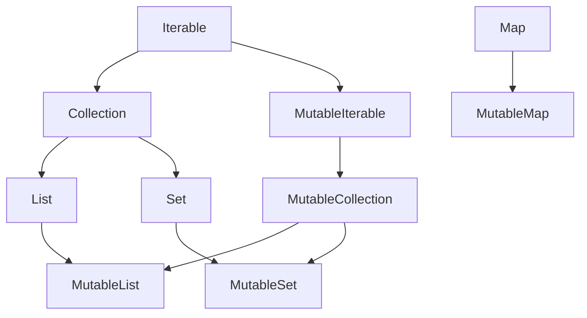

# Теория Kotlin: Часть 2

В первой части мы познакомились с базовым синтаксисом языка **Kotlin**: 
переменными, типами данных, строками, условиями, циклами и вводом/выводом.

## Функции

Функции позволяют объединять несколько инструкций в отдельную логическую 
единицу.

Функция может получать данные через параметры и возвращать результат.

Функция объявляется с помощью ключевого слова `fun`.

```kotlin
fun sum(a: Int, b: Int): Int {
    return a + b
}
```

| Код              | Описание                   |
|------------------|----------------------------|
| `fun`            | объявление функции         |
| `sum`            | имя функции                |
| `a: Int, b: Int` | параметры                  |
| `Int` после `):` | тип возвращаемого значения |
| `return`         | возвращаем результат       |


Вызвать функцию можно по имени:

```kotlin
val result = sum(2, 3)

println(result) // 5
```

### Параметры функции

Параметры указываются в круглых скобках после имени функции:

```kotlin
fun greet(name: String) {
    println("Hello, $name!")
}
```

Вызов:

```kotlin
greet("Alex")
```

Функция может иметь несколько параметров:

```kotlin
fun printUser(name: String, age: Int) {
    println("Name: $name")
    println("Age: $age")
}
```

Вызов:

```kotlin
printUser("Alex", 25)
```

Тип каждого параметра указывается после его имени: `name: String`, 
`age: Int`

### Возвращаемое значение

Функция может вернуть результат с помощью `return`.

```kotlin
fun multiply(a: Int, b: Int): Int {
return a * b
}
```

Использование:

```kotlin
val result = multiply(4, 5)

println(result) // 20
```

После `return` функция завершает своё выполнение и передаёт указанное 
значение вызывающему коду.

Например:

```kotlin
fun getSign(number: Int): String {
    if (number > 0) {
        return "Положительное"
    }
    return "Не положительное"
}
```

### Unit

Функция, которая ничего не возвращает в практическом смысле, имеет 
возвращаемый тип `Unit`.

Обычно **Kotlin** позволяет не указывать `Unit` явно:

```kotlin
fun sayHello(name: String) {
    println("Hello, $name!")
}
```

То же самое с явным указанием типа:

```kotlin
fun sayHello(name: String): Unit {
    println("Hello, $name!")
}
```

`Unit` является полноценным типом **Kotlin** и имеет единственное значение 
— `Unit`.

В **Java**, **C++**, **C#** и других языках похожую роль выполняет `void`.

Для обычных функций, которые только выполняют действие, чаще всего 
пишут вариант без `: Unit`.

### Функция с одним выражением

Если тело функции состоит из одного выражения, можно использовать 
сокращённый синтаксис:

```kotlin
fun sum(a: Int, b: Int) = a + b
```

Вместо:

```kotlin
fun sum(a: Int, b: Int): Int {
    return a + b
}
```

**Kotlin** выводит тип возвращаемого значения из выражения.

При необходимости тип можно указать явно:

```kotlin
fun sum(a: Int, b: Int): Int = a + b
```

Такой синтаксис особенно удобен для небольших функций.

Например:

```kotlin
fun square(number: Int) = number * number
```

<!-- prettier-ignore -->
> [!CAUTION]
> В функции с телом-выражением `return` не используется
> 
> ```kotlin
> fun sum(a: Int, b: Int) = a + b
> ```
> 
> Нельзя писать:
> 
> ```kotlin
> // fun sum(a: Int, b: Int) = return a + b
> ```
> 
> `return` используется в функциях с блочным телом:
> 
> ```kotlin
> fun sum(a: Int, b: Int) {
>     return a + b
> }
> ```

### Параметры по умолчанию

Для параметров можно указать значение по умолчанию.

```kotlin
fun greet(
    name: String, 
    greeting: String = "Hello"
) {
    println("$greeting, $name!")
}
```

Теперь функцию можно вызвать с двумя аргументами:

```kotlin
greet("Alex", "Hi")
```

или только с одним:

```kotlin
greet("Alex")
```

Во втором случае будет использовано значение `"Hello"`.

Параметров со значениями по умолчанию может быть несколько:

```kotlin
fun createUser(
    name: String,
    age: Int = 18,
    city: String = "Unknown"
) {
    println("$name, $age, $city")
}
```

### Именованные аргументы

Аргументы функции можно передавать по имени:

```kotlin
fun createUser(
    name: String, 
    age: Int
) {
    println("$name: $age")
}

createUser(name = "Alex", age = 25)
```

Именованные аргументы особенно полезны, когда у функции много 
параметров или несколько параметров имеют одинаковый тип.

Можно указать аргументы в другом порядке:

```kotlin
createUser(
    age = 25,
    name = "Alex"
)
```

Именованные аргументы также удобно комбинировать со значениями по умолчанию:

```kotlin
fun greet(
    name: String,
    greeting: String = "Hello",
    punctuation: String = "!"
) {
    println("$greeting, $name$punctuation")
}

greet(
    name = "Alex",
    punctuation = "."
)
```

### Область видимости переменных

Переменная, объявленная внутри функции, доступна только внутри 
этой функции:

```kotlin
fun test() {
    val message = "Hello"

    println(message)
}
```

Нельзя обратиться к message из другой функции:

```kotlin
fun test() {
    val message = "Hello"
}

fun main() {
// println(message) // ошибка
}
```

Такие переменные называются локальными.

## Null safety

Одна из важных особенностей **Kotlin** — встроенная защита от `null`.

По умолчанию обычная переменная не может содержать `null`:

```kotlin
val name: String = "Kotlin"
```

Следующая запись вызовет ошибку компиляции:

```kotlin
// val name: String = null
```

Чтобы разрешить `null`, используется nullable-тип со знаком `?`:

```kotlin
val name: String? = null
```

Теперь переменная может содержать как строку, так и `null`.

### Безопасный вызов

Чтобы безопасно обратиться к объекту, который может быть `null`, 
используется оператор `?.`:

```kotlin
val name: String? = null

println(name?.length)
```

Если `name` содержит `null`, выражение `name?.length` также даст `null` 
вместо возникновения `NullPointerException`.

### Оператор Elvis

Оператор `?:` позволяет указать значение, которое будет использовано 
вместо `null`:

```kotlin
val name: String? = null

val length = name?.length ?: 0

println(length) // 0
```

Читается это примерно как:

> если `name?.length` не `null`, используй его; иначе используй `0`.

### Явная проверка на `null`

Можно выполнить обычную проверку:

```kotlin
val name: String? = "Kotlin"

if (name != null) {
    println(name.length)
}
```

После проверки Kotlin обычно автоматически учитывает, что внутри этой 
ветки значение не равно `null`.

### Оператор `!!`

Оператор `!!` принудительно рассматривает nullable-значение как не `null`:

```kotlin
val name: String? = "Kotlin"

println(name!!.length)
```

Если в момент выполнения `name` окажется равен `null`, будет выброшен 
`NullPointerException`.

Поэтому `!!` следует использовать осторожно. Во многих случаях безопаснее 
применить `?.`, проверку на `null` или оператор `?:`.

## Классы

Класс объявляется с помощью ключевого слова `class`:

```kotlin
class User
```

Создать объект класса можно напрямую:

```kotlin
val user = User()
```

Свойства можно объявлять прямо в заголовке класса:

```kotlin
class User(
    val name: String,
    val age: Int
)
```

Теперь объект можно создать следующим образом:

```kotlin
val user = User("Alex", 25)

println(user.name)
println(user.age)
```

Такой синтаксис позволяет одновременно объявить конструктор и свойства класса.

По умолчанию классы **Kotlin** являются `final`, то есть от них нельзя наследоваться. 
Чтобы разрешить наследование, используется ключевое слово `open`:

```kotlin
open class Animal

class Dog : Animal()
```

В **Kotlin** наследование указывается после двоеточия.

## Коллекции



Для хранения нескольких значений **Kotlin** предоставляет коллекции. Наиболее 
часто используются `List`, `Set` и `Map`.

`List` хранит элементы в определённом порядке и допускает повторения:

```kotlin
val fruits = listOf("apple", "banana", "apple")

println(fruits[0])
println(fruits.size)
```

Для изменяемого списка используется `MutableList`:

```kotlin
val fruits = mutableListOf("apple", "banana")

fruits.add("orange")
fruits.remove("apple")
```

`Set` хранит уникальные элементы:

```kotlin
val numbers = setOf(1, 2, 3, 3)

println(numbers) // [1, 2, 3]
```

`Map` хранит пары «ключ — значение»:

```kotlin
val users = mapOf(
    "Alex" to 25,
    "Maria" to 30
)

println(users["Alex"])
```

Коллекции можно перебирать с помощью уже знакомого цикла `for`:

```kotlin
for (fruit in fruits) {
    println(fruit)
}
```
