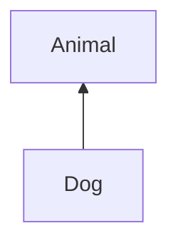
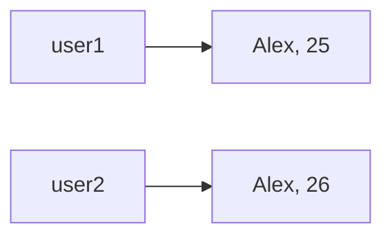
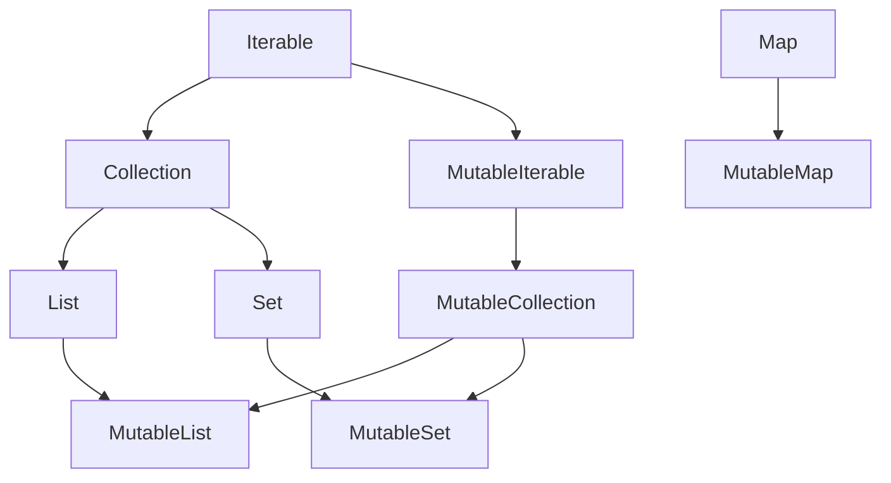
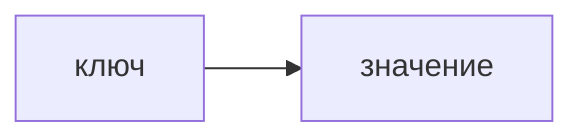
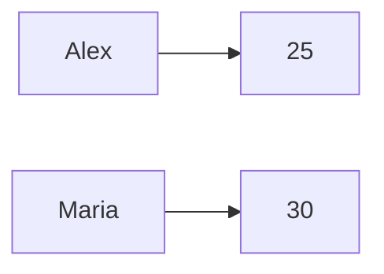
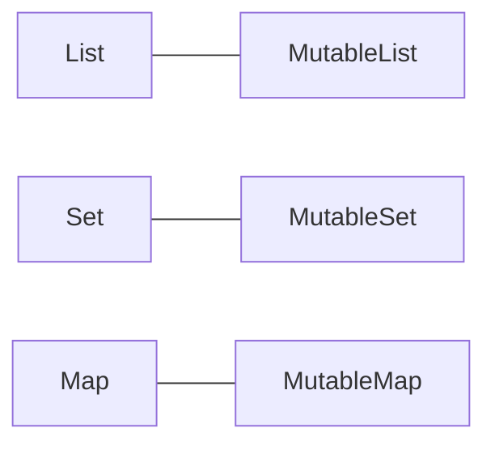

# Теория Kotlin: Часть 3

## Классы

Класс — это описание структуры и поведения объектов.

С помощью класса можно объединить связанные данные и функции в одну
сущность.

Класс объявляется с помощью ключевого слова `class`:

```kotlin
class User
```

Сам класс является описанием.

Чтобы получить конкретный объект этого класса, создаётся экземпляр:

```kotlin
val user = User()
```

В **Kotlin** при создании объекта не требуется ключевое слово `new`.

### Свойства класса

Класс может содержать свойства:

```kotlin
class User {
    val name = "Alex"
    var age = 25
}
```

Обращаться к свойствам объекта можно через точку:

```kotlin
val user = User()

println(user.name)
println(user.age)
```

Если свойство объявлено как `var`, его значение можно изменить:

```kotlin
user.age = 26
```

### Первичный конструктор

Часто свойства удобнее сразу объявить в конструкторе класса:

```kotlin
class User(
    val name: String,
    val age: Int
)
```

Здесь `name` и `age` одновременно являются:

- параметрами первичного конструктора;
- свойствами объекта.

Теперь объект создаётся так:

```kotlin
val user = User("Alex", 25)

println(user.name)
println(user.age)
```

Это одна из наиболее часто используемых конструкций **Kotlin**.

### val и var в конструкторе

Если использовать `val`:

```kotlin
class User(
    val name: String
)
```

свойство нельзя переприсвоить:

```kotlin
val user = User("Alex")

// user.name = "Maria" // ошибка
```

Если использовать `var`:

```kotlin
class User(
    var name: String
)
```

значение можно изменить:

```kotlin
val user = User("Alex")

user.name = "Maria"
```

### Параметр конструктора без свойства

Не каждый параметр конструктора обязан становиться свойством.

Например:

```kotlin
class User(name: String) {
    val displayName = name
}
```

Здесь `name` — только параметр конструктора.

А `displayName` — свойство объекта.

После создания:

```kotlin
val user = User("Alex")

println(user.displayName) // Alex
```

Но обратиться к `user.name` нельзя, потому что name не объявлен
как свойство.

```kotlin
// println(user.name) // ошибка
```

### Свойства внутри класса

Свойства можно объявлять не только в конструкторе, но и внутри
тела класса:

```kotlin
class User(
    val name: String
) {
    var age: Int = 0
}
```

Использование:

```kotlin
val user = User("Alex")

user.age = 25

println(user.name) // Alex
println(user.age) // 25
```

Такой подход удобен, когда свойство не нужно передавать при
создании объекта или когда ему можно задать начальное значение
отдельно.

### Методы класса

Функции, объявленные внутри класса, называются функциями-членами
или методами.

Например:

```kotlin
class User(
    val name: String,
    val age: Int
) {
    fun sayHello() {
        println("Привет, я $name!")
    }
}
```

Создадим объект:

```kotlin
val user = User("Alex", 25)

user.sayHello()
```

Результат:

```
Привет, я Alex!
```

Метод может использовать свойства своего объекта напрямую:

```kotlin
class User(
    val name: String,
    val age: Int
) {
    fun introduce(): String {
        return "Меня зовут $name, мне $age лет."
    }
}
```

Использование:

```kotlin
val user = User("Alex", 25)

println(user.introduce()) // Меня зовут Alex, мне 25 лет
```

### this

Внутри класса `this` обозначает текущий объект.

Например:

```kotlin
class User(
    val name: String
) {
    fun printName() {
        println(this.name)
    }
}
```

В простых случаях `this` можно не писать:

```kotlin
println(name)
```

В **Kotlin** `this` особенно полезен, когда имена параметров и
свойств совпадают.

Например:

```kotlin
class User(name: String) {
    val name = name
}
```

Здесь левый `name` — свойство класса, а правый `name` — параметр
конструктора.

При необходимости можно написать:

```kotlin
class User(name: String) {
    val name = this.name
}
```

Но в таком конкретном примере это не то, что обычно требуется.
Проще использовать:

```kotlin
class User(val name: String)
```

### Блок init

Иногда при создании объекта необходимо выполнить дополнительную логику.

Для этого используется блок `init`:

```kotlin
class User(
    val name: String,
    val age: Int
) {
    init {
        println("Создан пользователь $name")
    }
}
```

Теперь:

```kotlin
val user = User("Alex", 25)
```

при создании объекта выполнит код из `init`.

Блок `init` часто используют для проверки входных данных.

Например:

```kotlin
class User(
    val name: String,
    val age: Int
) {
    init {
        require(age >= 0) {
            "Возраст не может быть отрицательным"
        }
    }
}
```

Если передать отрицательный возраст, будет выброшено исключение.

<!-- prettier-ignore -->
> [!NOTE]
> Функция `require` используется для проверки условия и 
> выбрасывания исключения, если условие не выполняется.

## Инкапсуляция

Одно из основных понятий ООП — инкапсуляция.

Идея заключается в том, что объект сам управляет своим внутренним 
состоянием, а наружу предоставляет только необходимый интерфейс.

Например, вместо полностью открытого свойства:

```kotlin
class BankAccount(
    var balance: Double
)
```

можно запретить изменение баланса снаружи:

```kotlin
class BankAccount(
    val owner: String
) {
    var balance: Double = 0.0
        private set

    fun deposit(amount: Double) {
        if (amount > 0) {
            balance += amount
        }
    }
}
```

Теперь:

```kotlin
val account = BankAccount("Alex")

account.deposit(100.0)

println(account.balance)
```

Но извне нельзя напрямую написать:

```kotlin
// account.balance = 1000.0
```

Потому что `set` имеет модификатор `private`.

Таким образом, объект сам контролирует изменение своего состояния.

### Модификаторы доступа

**Kotlin** предоставляет 4 основных модификатора видимости.

| Модификатор | Где доступен                           |
|-------------|----------------------------------------|
| `public`    | Везде, где доступно объявление         |
| `private`   | Только внутри соответствующей области  |
| `protected` | Только внутри класса и его наследников |
| `internal`  | Внутри одного модуля                   |

`public` используется по умолчанию, поэтому его обычно не пишут явно.

Например:

```kotlin
class User {
    private val password = "12345"
}
```

Извне:

```kotlin
val user = User()

// println(user.password) // ошибка
```

Скрытие внутреннего состояния помогает контролировать, как объект 
используется.

### Наследование

Наследование позволяет создать новый класс на основе существующего.

В **Kotlin** классы по умолчанию нельзя наследовать.

Чтобы разрешить наследование, используется `open`:

```kotlin
open class Animal
```

Теперь можно создать производный класс:

```kotlin
class Dog : Animal()
```

Здесь:



`Dog` наследуется от `Animal`.

### Наследование свойств и методов

Базовый класс может содержать свойства и методы:

```kotlin
open class Animal(
    val name: String
) {
    fun eat() {
        println("$name ест")
    }
}
```

Производный класс получает доступ к ним:

```kotlin
class Dog(
    name: String
) : Animal(name)
```

Теперь:

```kotlin
val dog = Dog("Buddy")

println(dog.name)
dog.eat()
```

Результат:

```
Buddy
Buddy ест
```

### Переопределение методов

Метод базового класса тоже по умолчанию нельзя переопределять.

Для этого необходимо пометить его как `open`:

```kotlin
open class Animal {
    open fun makeSound() {
        println("Какой-то звук")
    }
}
```

В производном классе используется `override`:

```kotlin
class Dog : Animal() {
    override fun makeSound() {
        println("Гав!")
    }
}
```

Теперь:

```kotlin
val dog = Dog()

dog.makeSound()
```

Результат:

```
Гав!
```

## Полиморфизм

Полиморфизм позволяет работать с объектами разных классов через 
общий тип.

Например:

```kotlin
open class Animal {
    open fun makeSound() {
        println("Какой-то звук")
    }
}

class Dog : Animal() {
    override fun makeSound() {
        println("Гав!")
    }
}

class Cat : Animal() {
    override fun makeSound() {
        println("Мяу!")
    }
}
```

Теперь можно написать:

```kotlin
fun playSound(animal: Animal) {
    animal.makeSound()
}
```

И передавать разные объекты:

```kotlin
playSound(Dog())
playSound(Cat())
```

Результат:

```
Гав!
Мяу!
```

Функции не нужно знать конкретный класс объекта. Ей достаточно того, 
что объект является `Animal`.

### Интерфейсы

Интерфейс описывает набор возможностей, которые должен предоставить 
класс.

Например:

```kotlin
interface Printable {
    fun printInfo()
}
```

Класс может реализовать интерфейс:

```kotlin
class User(
    val name: String
) : Printable {
    override fun printInfo() {
        println("Пользователь: $name")
    }
}
```

Использование:

```kotlin
val user = User("Alex")

user.printInfo()
```

Интерфейсы удобно использовать, когда разные классы должны 
поддерживать одинаковое поведение.

Например:

```kotlin
interface Flyable {
    fun fly()
}
```

И его могут реализовать разные классы:

```kotlin
class Bird : Flyable {
    override fun fly() {
        println("Птица летит")
    }
}

class Airplane : Flyable {
    override fun fly() {
        println("Самолёт летит")
    }
}
```

### data class

Во многих программах классы используются в первую очередь для 
хранения данных.

Для таких случаев **Kotlin** предоставляет специальный тип класса — 
`data class`.

```kotlin
data class User(
    val name: String,
    val age: Int
)
```

Основное назначение `data class` — представление данных.

**Kotlin** автоматически генерирует полезные методы, связанные 
с содержимым объекта, например `toString()`, `equals()`, `hashCode()` 
и `copy()`.

Поэтому:

```kotlin
val user = User("Alex", 25)

println(user)
```

даст удобное представление объекта:

```kotlin
User(name=Alex, age=25)
```

### Копирование data class

У `data class` есть функция `copy()`:

```kotlin
val user1 = User("Alex", 25)

val user2 = user1.copy(age = 26)
```

Теперь:


Исходный объект при этом не изменяется.

`data class` особенно удобно использовать для сущностей, 
которые в основном представляют набор данных.

## Коллекции

Коллекции используются для хранения нескольких значений.

В **Kotlin** есть read-only-интерфейсы коллекций и изменяемые 
(`Mutable`) варианты.



`Map` входит в стандартную систему коллекционных типов **Kotlin**, но 
не является наследником `Collection`.

### List

`List` хранит элементы в определённом порядке.

Элементы могут повторяться.

```kotlin
val fruits = listOf(
    "apple",
    "banana",
    "apple"
)
```

В списке три элемента.

Получить элемент можно по индексу:

```kotlin
println(fruits[0]) // apple
println(fruits[1]) // banana
```

Индексация начинается с `0`.

Также можно узнать размер:

```kotlin
println(fruits.size) // 3
```

### MutableList

`MutableList` — изменяемый список.

```kotlin
val fruits = mutableListOf(
    "apple",
    "banana"
)
```

Можно добавлять элементы:

```kotlin
fruits.add("orange")
```

Удалять:

```kotlin
fruits.remove("apple")
```

Изменять существующие элементы:

```kotlin
fruits[0] = "pear"
```

И получать результат:

```kotlin
println(fruits)
```

### val и MutableList

Очень важно не путать `val` и неизменяемость содержимого объекта.

Например:

```kotlin
val fruits = mutableListOf("apple", "banana")

fruits.add("orange")
```

Это допустимо.

`val` запрещает переприсвоить саму переменную:

```kotlin
// fruits = mutableListOf("pear") // ошибка
```

Но изменение содержимого `MutableList` разрешено.

Поэтому для изменяемых коллекций вполне нормально использовать:

```kotlin
val numbers = mutableListOf(1, 2, 3)
```

а не обязательно:

```kotlin
var numbers = mutableListOf(1, 2, 3)
```

### Set

`Set` хранит только уникальные элементы.

```kotlin
val numbers = setOf(1, 2, 3, 3)

println(numbers)
```

Результат содержит только уникальные значения:

```
[1, 2, 3]
```

Проверить наличие элемента можно с помощью `in`:

```kotlin
if (2 in numbers) {
    println("Число найдено")
}
```

Также существует изменяемый вариант:

```kotlin
val numbers = mutableSetOf(1, 2, 3)

numbers.add(4)
numbers.remove(1)
```

<!-- prettier-ignore -->
> [!CAUTION]
> По умолчанию стандартный `setOf` и `linkedSetOf` сохраняют порядок
> добавления элементов. `hashSetOf` порядок не сохраняет, но работает 
> быстрее и требует меньше памяти. Например:

<iframe src="https://pl.kotl.in/OEIWmNGkx" height="200"></iframe>

### Map

`Map` хранит пары:



Например:

```kotlin
val users = mapOf(
    "Alex" to 25,
    "Maria" to 30
)
```

Здесь:



Получить значение можно по ключу:

```kotlin
println(users["Alex"])
```

Результат:

```
25
```

Ключи в `Map` уникальны.

### MutableMap

Для изменения `Map` используется `MutableMap`:

```kotlin
val users = mutableMapOf(
"Alex" to 25,
"Maria" to 30
)
```

Можно добавить новую пару:

```kotlin
users["John"] = 28
```

Можно изменить существующее значение:

```kotlin
users["Alex"] = 26
```

Удалить элемент:

```kotlin
users.remove("Maria")
```

## Перебор коллекций

Коллекции можно перебирать с помощью уже знакомого цикла `for`.

### List

```kotlin
val fruits = listOf(
    "apple",
    "banana",
    "orange"
)

for (fruit in fruits) {
    println(fruit)
}
```

### Set

```kotlin
val numbers = setOf(1, 2, 3)

for (number in numbers) {
    println(number)
}
```

### Map

Для `Map` можно перебирать пары ключ-значение:

```kotlin
val users = mapOf(
    "Alex" to 25,
    "Maria" to 30
)

for ((name, age) in users) {
    println("$name: $age")
}
```

Здесь `(name, age)` получают ключ и соответствующее ему значение. 
Называть их можно так же, как и обычные переменные.

## Read-only и Mutable коллекции

В **Kotlin** важно различать:



Read-only-интерфейс предоставляет операции чтения:

```kotlin
val numbers: List<Int> = listOf(1, 2, 3)

println(numbers.size)
println(numbers[0])
```

А mutable-вариант дополнительно позволяет изменять содержимое:

```kotlin
val numbers: MutableList<Int> = mutableListOf(1, 2, 3)

numbers.add(4)
numbers.remove(1)
```

По возможности используйте read-only тип, если изменение коллекции 
не требуется.

Например:

```kotlin
fun printNumbers(numbers: List<Int>) {
    for (number in numbers) {
        println(number)
    }
}
```

Такая функция сообщает вызывающему коду, что сама функция не требует 
изменяемого списка.

## Когда какую коллекцию использовать

| Коллекция             | Когда использовать                                                  | Особенности                                                             |
|-----------------------|---------------------------------------------------------------------|-------------------------------------------------------------------------|
| **`List` (Списки)**   | Нужен четкий порядок элементов и поиск по индексу                   | Допускает дубликаты                                                     |
| `ArrayList`           | Самый частый выбор по умолчанию                                     | Быстро читает по индексу, но медленно удаляет из середины               |
| `LinkedList`          | Нужно постоянно вставлять/удалять элементы в начало или середину    | Медленный доступ по индексу (приходится перебирать с начала)            |
| **`Set` (Множества)** | Нужны только уникальные значения (без повторов)                     | Дубликаты автоматически игнорируются                                    |
| `HashSet`             | Порядок не важен, нужна максимальная скорость                       | Самый быстрый поиск, добавление и удаление. Порядок элементов случайный |
| `LinkedHashSet`       | Нужна уникальность, но важно сохранить порядок добавления           | Чуть медленнее, чем `HashSet`, но помнит, что за чем шло                |
| `TreeSet`             | Элементы должны быть всегда отсортированы (по возрастанию/алфавиту) | Медленнее остальных `Set`, но данные всегда в порядке                   |
| **`Map` (Словари)**   | Нужны пары "ключ — значение" (поиск значения по ключу)              | Ключи всегда уникальны, значения могут повторяться                      |
| `HashMap`             | Порядок ключей не важен, нужна максимальная скорость                | Быстрый доступ к значению по ключу. Порядок не гарантирован             |
| `LinkedHashMap`       | Нужны пары "ключ-значение" с сохранением порядка добавления         | Помнит порядок, в котором вы добавляли элементы                         |
| `TreeMap`             | Ключи должны быть всегда отсортированы                              | Сортирует пары по ключу. Медленнее, чем `HashMap`                       |
| **`Queue` (Очереди)** | Нужен порядок обработки элементов                                   | Обычно работает по принципу "первым пришел — первым ушел"               |

Например:

### Список оценок

```kotlin
val grades = listOf(5, 4, 5, 3, 4)
```

### Множество уникальных городов

```kotlin
val cities = setOf(
    "Москва",
    "Берлин",
    "Москва"
)
```

### Пользователи и их возраст

```kotlin
val users = mapOf(
    "Alex" to 25,
    "Maria" to 30
)
```

#### Коллекции и функции

Функции можно передавать в качестве параметров другим функциям. 
Это является основой функционального стиля **Kotlin** и будет подробнее 
рассмотрено в далее.

Например, стандартная библиотека **Kotlin** предоставляет операции 
над коллекциями:

```kotlin
val numbers = listOf(1, 2, 3, 4, 5)

val evenNumbers = numbers.filter { it % 2 == 0 }

println(evenNumbers)
```

Результат:

```
[2, 4]
```

Здесь `{ it % 2 == 0 }` — небольшая функция, которая проверяет каждый 
элемент.

Пока достаточно понимать общий принцип:

Многие операции над коллекциями позволяют описать, что сделать с 
каждым элементом, а не писать цикл вручную.

Подробно лямбда-выражения и функции высшего порядка будут рассмотрены 
отдельно.