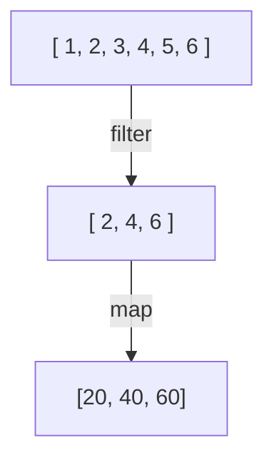
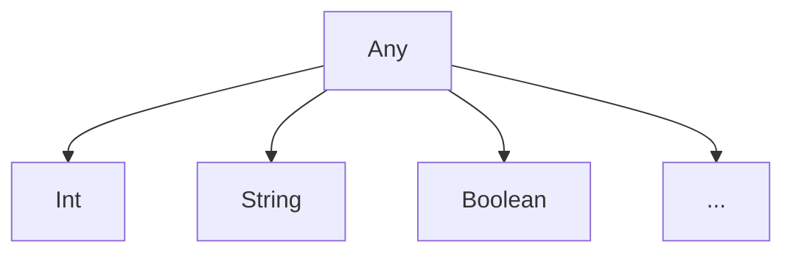

# Теория Kotlin: Часть 4

## Коллекции и лямбды

Лямбда-выражения особенно часто используются при обработке коллекций.

Например, вместо ручного цикла:

```kotlin
val numbers = listOf(1, 2, 3, 4, 5)

for (number in numbers) {
    println(number * 2)
}
```

можно использовать `map`:

```kotlin
val numbers = listOf(1, 2, 3, 4, 5)

val doubled = numbers.map {
    it * 2
}

println(doubled)
```

Результат:

```
[2, 4, 6, 8, 10]
```

### map

`map` преобразует каждый элемент коллекции и создаёт новую коллекцию.

```kotlin
val numbers = listOf(1, 2, 3, 4)

val doubled = numbers.map {
    it * 2
}
```

Получим:

```
[2, 4, 6, 8]
```

### filter

`filter` оставляет только те элементы, которые удовлетворяют условию.

```kotlin
val numbers = listOf(1, 2, 3, 4, 5, 6)

val evenNumbers = numbers.filter {
    it % 2 == 0
}

println(evenNumbers)
```

Результат:

```
[2, 4, 6]
```

Можно использовать более сложное условие:

```kotlin
val numbers = listOf(5, 10, 15, 20, 25)

val result = numbers.filter {
    it > 10
}

println(result)
```

### forEach

`forEach` позволяет выполнить действие для каждого элемента:

```kotlin
val names = listOf(
    "Alex",
    "Maria",
    "John"
)

names.forEach {
    println(it)
}
```

Это похоже на:

```kotlin
for (name in names) {
    println(name)
}
```

### find

`find` возвращает первый элемент, удовлетворяющий условию, либо `null`, если подходящего элемента нет.

```kotlin
val numbers = listOf(1, 3, 5, 8, 10)

val result = numbers.find {
    it % 2 == 0
}

println(result) // 8
```

Если элемент не найден:

```kotlin
val result = numbers.find {
    it > 100
}

println(result) // null
```

Здесь снова используется `null safety`, которую мы изучили ранее.

### any

`any` проверяет, существует ли хотя бы один элемент, удовлетворяющий условию:

```kotlin
val numbers = listOf(1, 3, 5, 8)

val hasEven = numbers.any {
    it % 2 == 0
}

println(hasEven) // true
```

### all

`all` проверяет, удовлетворяют ли условию все элементы:

```kotlin
val numbers = listOf(2, 4, 6, 8)

val allEven = numbers.all {
    it % 2 == 0
}

println(allEven) // true
```

### count

`count` позволяет посчитать количество элементов, удовлетворяющих условию:

```kotlin
val numbers = listOf(1, 2, 3, 4, 5, 6)

val evenCount = numbers.count {
    it % 2 == 0
}

println(evenCount) // 3
```

### sum и average

Для числовых коллекций можно использовать готовые операции:

```kotlin
val numbers = listOf(10, 20, 30, 40)

println(numbers.sum())     // 100
println(numbers.average()) // 25.0
```

Это особенно удобно при решении практических задач.

## Неиспользуемые параметры

Иногда лямбда получает несколько параметров, но один из них нам не нужен.

В таком случае для неиспользуемого параметра можно использовать `_`.

Например, у `Map` при переборе есть ключ и значение:

```kotlin
val users = mapOf(
    "Alex" to 25,
    "Maria" to 30
)
```

Если нам нужны только значения:

```kotlin
users.forEach { _, age ->
    println(age)
}
```

Здесь:

- `_` - ключ нам не нужен
- `age` - значение нам нужно

Без `_` пришлось бы дать ненужному параметру имя:

```kotlin
users.forEach { name, age ->
    println(age)
}
```

В таком случае `name` фактически не используется.

Поэтому:

```kotlin
users.forEach { _, age ->
    println(age)
}
```

лучше показывает намерение программиста.

## Деструктизация

В **Kotlin** можно одновременно получить несколько частей объекта и сохранить 
их в отдельные переменные.

Например, у нас есть пользователь:

```kotlin
data class User(
    val name: String,
    val age: Int
)

val user = User("Alex", 25)
```

Без деструктуризации к свойствам пришлось бы обращаться отдельно:

```kotlin
val name = user.name
val age = user.age

println(name)
println(age)
```

**Kotlin** позволяет записать то же самое короче:

```kotlin
val (name, age) = user

println(name)
println(age)
```

Такая запись называется деструктурирующим объявлением (`destructuring declaration`).

```
val (name, age) = user
      │     │
      │     └── второе значение
      └───────── первое значение
```

В результате создаются две отдельные переменные:

- `name` - `"Alex"`
- `age` - `25`

### Как работает деструктуризация

На самом деле **Kotlin** преобразует такую запись в вызовы специальных функций:

```kotlin
val (name, age) = user
```

упрощённо соответствует:

```kotlin
val name = user.component1()
val age = user.component2()
```

Именно функции `component1()`, `component2()`, `component3()` и т. д. определяют, 
какие значения можно получить при деструктуризации.

Для `data class` эти функции автоматически генерируются компилятором для свойств 
`primary constructor` в порядке их объявления.

Например:

```kotlin
data class User(
    val name: String,
    val age: Int,
    val city: String
)
```

позволяет написать:

```kotlin
val user = User("Alex", 25, "Berlin")
val (name, age, city) = user
```

Что примерно соответствует:

```kotlin
val name = user.component1()
val age = user.component2()
val city = user.component3()
```

### Порядок имеет значение

Обычная деструктуризация в **Kotlin** является позиционной.

То есть переменные получают значения не по именам, а по порядку.

Например:

```kotlin
data class User(
    val name: String,
    val age: Int
)

val user = User("Alex", 25)

val (name, age) = user
```

Получим:

- `name` - `"Alex"`
- `age` - `25`

Но можно написать:

```kotlin
val (age, name) = user
```

И это не означает, что **Kotlin** найдёт свойство `age` по имени.

Получится:

- `age` - `"Alex"`
- `name` - `25`

Хотя сами имена переменных выглядят как `age` и `name`.

Поэтому важно запомнить:

В обычной деструктуризации позиция переменной определяет, какой 
`componentN()` будет вызван.

- первое значение - `component1()`
- второе значение - `component2()`
- третье значение - `component3()`

Для этого особенно важно не путать имя локальной переменной с тем, 
какую часть объекта она получает.

<!-- prettier-ignore -->
> [!NOTE]
> В современных версиях **Kotlin** существует экспериментальный режим 
> деструктуризации по именам свойств. Он не рассматривается в этой методичке, 
> поскольку основная тема курса использует стандартную позиционную модель 
> деструктуризации.

### Деструктуризация и _

`_` используется также при деструктуризации.

Например:

```kotlin
data class User( 
    val name: String, 
    val age: Int, 
    val city: String 
)

val user = User("Alex", 25, "Berlin")
```

Если имя `age` не нужен:

```kotlin
val (name, _, city) = user
```

В этом случае второй компонент сознательно пропускается.

- `name` - `"Alex"`
- `_` - пропущено
- `city` - `"Berlin""`

То же можно увидеть при работе с `Map` и циклах `for`:

```kotlin
val users = mapOf(
    "Alex" to 25,
    "Maria" to 30
)

for ((_, age) in users) {
    println(age)
}
```

Вывод:

```
25
30
```

### Деструктуризация результата функции

Функция может вернуть объект `data class`, после чего результат 
можно сразу деструктурировать.

Например:

```kotlin
data class Result(
    val value: Int,
    val status: String
)

fun calculate(): Result {
    return Result(42, "OK")
}
```

Теперь:

```kotlin
val (value, status) = calculate()

println(value)
println(status)
```

Получим:

```
42
OK
```

### Деструктуризация в лямбдах

Деструктуризацию можно использовать и в параметрах лямбды.

Например:

```kotlin
val users = mapOf(
    "Alex" to 25,
    "Maria" to 30
)
```

Без деструктуризации:

```kotlin
users.forEach { entry ->
    println("${entry.key}: ${entry.value}")
}
```

С деструктуризацией:

```kotlin
users.forEach { (name, age) ->
    println("$name: $age")
}
```

Здесь лямбда `forEach` получает один объект `Map.Entry`, а запись:

```kotlin
(name, age)
```

деструктурирует этот объект на два значения.

Это важно не путать с двумя отдельными параметрами:

```kotlin
{ a, b -> ... }
```

и деструктурированным одним параметром:

```kotlin
{ (a, b) -> ... }
```

Это разные конструкции.

- `{ a, b -> ... }` - означает два параметра
- `{ (a, b) -> ... }` - один параметр, который деструктурируется

### Деструктуризация и изменение переменных

Деструктуризация работает и с `var`:

```kotlin
var (name, age) = User("Alex", 25)

name = "Maria"
age = 30
```

Здесь создаются обычные локальные переменные.

При этом изменение:

```kotlin
name = "Maria"
```

не изменяет исходный объект `User`.

### Деструктуризация не создаёт копию объекта

Рассмотрим:

```kotlin
data class User(
    val name: String,
    val age: Int
)

val user = User("Alex", 25)

val (name, age) = user
```

Здесь `name` и `age` — отдельные локальные значения.

Мы не получили новый объект `User`.

Чтобы создать новый объект на основе существующего, используется `copy()`:

```kotlin
val updatedUser = user.copy(age = 26)
```

Это разные операции:

- `destructuring` - извлечь значения
- `copy()` - создать копию объекта

### Когда использовать деструктуризацию

Деструктуризация особенно удобна, когда:

#### 1. Нужно получить несколько связанных значений
```kotlin
val (name, age) = user
```

#### 2. Нужно вернуть несколько результатов
```kotlin
val (value, status) = calculate()
```

#### 3. Нужно перебрать Map
```kotlin
for ((key, value) in map) {
    ...
}
```

#### 4. Нужно работать с объектами в коллекции
```kotlin
users.forEach { (name, age) ->
    ...
}
```

#### 5. Нужно пропустить ненужные значения
```kotlin
val (_, age) = user
```

## Function references

Иногда необходимо передать в другую функцию уже существующую функцию.

Для этого в **Kotlin** используется оператор `::`, ссылка на функцию.

Например, создадим обычную функцию:

```kotlin
fun isEven(number: Int): Boolean {
    return number % 2 == 0
}
```

Мы можем передать её в `filter`:

```kotlin
val numbers = listOf(1, 2, 3, 4, 5, 6)

val evenNumbers = numbers.filter(::isEven)

println(evenNumbers)
```

Результат:

```
[2, 4, 6]
```

Здесь `::isEven` означает ссылку на функцию `isEven`. Это не вызов функции.

Сравните:

```kotlin
isEven(4)
```

Здесь функция вызывается и возвращает:

```
true
```

А `::isEven` создаёт ссылку на саму функцию, которую можно передать дальше.

### Сравнение лямбды и ссылки на функцию

Один и тот же код можно записать двумя способами.

С помощью лямбды:

```kotlin
val evenNumbers = numbers.filter {
    it % 2 == 0
}
```

С помощью ссылки на существующую функцию:

```kotlin
fun isEven(number: Int): Boolean {
    return number % 2 == 0
}

val evenNumbers = numbers.filter(::isEven)
```

Первый вариант непосредственно описывает действие.

Второй вариант говорит:

> Используй уже существующую функцию `isEven`.

Это особенно удобно, когда функция уже существует и её сигнатура подходит ожидаемому типу.

### Тип ссылки на функцию

Ссылка `::isEven` в данном примере имеет тип:

```kotlin
(Int) -> Boolean
```

То есть:

- `(Int)` - параметр типа `Int`
- `-> Boolean` - результат типа `Boolean`

Можно сохранить ссылку в переменную:

```kotlin
fun square(number: Int): Int {
    return number * number
}

val operation: (Int) -> Int = ::square

println(operation(5)) // 25
```

Теперь `operation` содержит ссылку на функцию `square`.

### Ссылка на функцию с несколькими параметрами

Это работает и для нескольких параметров:

```kotlin
fun sum(a: Int, b: Int): Int {
return a + b
}

val operation: (Int, Int) -> Int = ::sum

println(operation(2, 3)) // 5
```

Тип:

```kotlin
(Int, Int) -> Int
```

означает:

* два параметра типа `Int`
* результат типа `Int`

### Ссылки на методы

Оператор `::` можно использовать не только с обычными функциями, но и с методами.

Например:

```kotlin
class User(
    val name: String
) {
    fun sayHello() {
        println("Hello, $name!")
    }
}
```

Для конкретного объекта можно получить ссылку на его метод:

```kotlin
val user = User("Alex")

val action = user::sayHello

action()
```

Здесь `user::sayHello` означает ссылку на метод конкретного объекта `user`.

Такую ссылку называют `bound callable reference`.

### Ссылка на метод класса

Можно также получить ссылку на метод самого класса:

```kotlin
class Calculator {
    fun square(number: Int): Int {
        return number * number
    }
}
```

Ссылка:

```kotlin
val operation = Calculator::square
```

В этом случае объект `Calculator` ещё не выбран.

Тип ссылки будет включать сам объект как дополнительный параметр:

```kotlin
Calculator.(Int) -> Int
```

На практике такие ссылки встречаются реже на начальном уровне, поэтому 
достаточно понимать основную идею:

`::` позволяет ссылаться на уже существующую функцию или метод и 
передавать эту ссылку как значение.

<iframe src="https://pl.kotl.in/qF9leLhmJ" height="290"></iframe>

### Ссылка на конструктор

Оператор `::` также используется для ссылки на конструктор.

Например:

```kotlin
data class User(
    val name: String,
    val age: Int
)
```

Можно получить ссылку:

```kotlin
val createUser = ::User
```

Теперь:

```kotlin
val user = createUser("Alex", 25)

println(user)
```

Получается:

```
User(name=Alex, age=25)
```

### Callable references

`::` — не только для функций. 

Оператор `::` является более общим механизмом `callable references`.

С его помощью можно ссылаться на:

* функции;
* методы;
* свойства;
* конструкторы;
* некоторые другие вызываемые сущности.

Например:

```kotlin
data class User(
    val name: String,
    val age: Int
)

val getName = User::name
```

Здесь `User::name` — ссылка на свойство `name`.

<iframe src="https://pl.kotl.in/WcFITCsz_" height="280"></iframe>

## Цепочки операций

Операции над коллекциями можно объединять:

```kotlin
val numbers = listOf(1, 2, 3, 4, 5, 6)

val result = numbers
    .filter { it % 2 == 0 }
    .map { it * 10 }

println(result)
```

Выполняются по порядку:



Такой код позволяет последовательно описать преобразование данных.

## Any

До этого мы уже использовали конкретные типы:

* `String`
* `Int`
* `Double`
* `Boolean`
* `User`

Но иногда необходимо написать функцию, которая принимает значение 
любого обычного типа.

Для этого существует тип `Any`.

```kotlin
fun printValue(value: Any) {
    println(value)
}
```

Теперь можно передать разные значения:

```kotlin
printValue(10)
printValue("Hello")
printValue(true)
printValue(3.14)
```

`Any` является базовым нетривиальным супертипом всех `non-nullable` типов **Kotlin**.

Упрощённо это можно представить так:



Поэтому значение любого из этих типов можно передать туда, где ожидается `Any`.

### Any?

`Any` сам по себе не допускает `null`.

```kotlin
val value: Any = 10
```

Нельзя:

```kotlin
// val value: Any = null
```

Если значение может быть `null`, используется:

```kotlin
Any?
```

Например:

```kotlin
val value: Any? = null
```

По аналогии:

`Any` - любое `non-null` значение

`Any?` - любое значение, включая `null`

Это продолжает общую систему `null safety`.

### Как работать с Any

Поскольку переменная типа `Any` может содержать совершенно разные 
значения, компилятор не знает их конкретный тип заранее.

Например:

```kotlin
fun printLength(value: Any) {
    // value.length
}
```

Такой код не скомпилируется: у `Any` нет свойства `length`.

Сначала необходимо проверить тип.

Для этого используется `is`.

```kotlin
fun printInfo(value: Any) {
    when (value) {
        is String -> println("Строка длиной ${value.length}")
        is Int -> println("Целое число: $value")
        is Boolean -> println("Boolean: $value")
        else -> println("Другой тип")
    }
}
```

Теперь **Kotlin** знает конкретный тип внутри соответствующей ветки.

### is и smart cast

Оператор `is` проверяет, является ли значение объектом определённого типа:

```kotlin
val value: Any = "Kotlin"

if (value is String) {
    println(value.length)
}
```

Внутри `if` **Kotlin** автоматически рассмотрит `value` как `String`.

Это ещё один пример `smart cast`.

До проверки:

```kotlin
value: Any
```

После:

```kotlin
if (value is String) {
    // value: String
}
```

### Any и коллекции разных типов

Если в одной коллекции находятся значения разных типов, **Kotlin** 
может использовать общий тип `Any`.

Например:

```kotlin
val values = listOf(
    10,
    "Kotlin",
    true
)
```

Здесь элементы имеют разные типы:

```kotlin
Int
String
Boolean
```

Общим `non-nullable` типом для них является `Any`.

Поэтому такую коллекцию можно представить как:

```kotlin
List<Any>
```

Теперь можно перебрать её:

```kotlin
for (value in values) {
    when (value) {
        is Int -> println("Число: $value")
        is String -> println("Строка: $value")
        is Boolean -> println("Логическое значение: $value")
    }
}
```

### Any и Object в Java

На первый взгляд `Any` похож на `Object` в **Java**.

Для начального понимания эту аналогию можно использовать:
**Kotlin** `Any` ≈ **Java** `Object`

Но это не полные синонимы.

В **Kotlin**:

```kotlin
Any
```

представляет `non-nullable` значения, а:

```kotlin
Any?
```

может содержать `null`.

В **Java** `Object` также связан с `nullable`-ссылками, поскольку `null` может 
быть присвоен ссылочному типу.

Поэтому при переносе кода между **Kotlin** и **Java** важно учитывать различия 
их систем типов и `null safety`.

### Когда использовать Any

`Any` полезен, когда функция или структура действительно должна работать со 
значениями разных типов.

Например:

```kotlin
fun printValue(value: Any) {
    println(value)
}
```

Но не стоит использовать `Any` просто "на всякий случай".

Если функция ожидает конкретный тип:

```kotlin
fun printUser(user: User)
```

лучше указать `: User`, а не `: Any`.

Конкретный тип даёт компилятору больше информации и делает код безопаснее и 
понятнее.

## Extension functions

**Kotlin** позволяет добавлять функции к существующим типам без изменения исходного класса.

Такие функции называются `extension functions`.

Например:

```kotlin
fun String.greet(): String {
    return "Hello, $this!"
}
```

Теперь у `String` появилась дополнительная функция:

```kotlin
val name = "Alex"

println(name.greet())
```

Результат:

```
Hello, Alex!
```

## Extension function для собственного типа

`Extensions` можно создавать и для собственных классов:

```kotlin
data class User(
    val name: String,
    val age: Int
)

fun User.isAdult(): Boolean {
    return age >= 18
}
```

Теперь:

```kotlin
val user = User("Alex", 25)

println(user.isAdult())
```

`Extension function` не изменяет сам класс `User`. Она просто 
позволяет вызывать отдельную функцию в удобном синтаксисе. 
Инкапсуляция не нарушается.