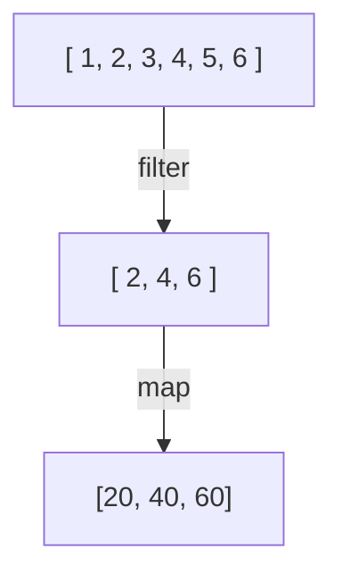

# Теория Kotlin: Часть 4

## Лямбда-выражения

В **Kotlin** функции являются обычными значениями.

Это означает, что функцию можно:

* сохранить в переменную;
* передать в другую функцию;
* вернуть из функции.

Для небольших функций удобно использовать лямбда-выражения.

Простейшая лямбда:

```kotlin
val sum = { a: Int, b: Int -> a + b }
```

Теперь `sum` содержит функцию, которую можно вызвать:

```kotlin
println(sum(2, 3)) // 5
```

Общая форма лямбды:

```
{ параметры -> тело }
```

Например:

```kotlin
val square = { number: Int -> number * number }

println(square(5)) // 25
```

### Лямбда без параметров

Если параметров нет, стрелку можно не использовать:

```kotlin
val hello = {
    println("Hello!")
}

hello()
```

### Лямбда с одним параметром

Если лямбда принимает один параметр, **Kotlin** позволяет 
обращаться к нему через специальное имя `it`:

```kotlin
val square: (Int) -> Int = {
    it * it
}
```

Вызов:

```kotlin
println(square(5)) // 25
```

Здесь:

```kotlin
(Int) -> Int
```

означает, что функция принимает `Int` и возвращает `Int`

## Тип функции

Функции тоже имеют тип.

Например:

```kotlin
(Int) -> String
```

означает:

> функция принимает `Int` и возвращает `String`.

Можно явно указать такой тип:

```kotlin
val describe: (Int) -> String = {
    "Число: $it"
}
```

Использование:

```kotlin
println(describe(10)) // Число: 10
```

Другой пример:

```kotlin
val isEven: (Int) -> Boolean = {
    it % 2 == 0
}
```

## Функции высшего порядка

Функция называется функцией высшего порядка, если она принимает 
другую функцию в качестве параметра или возвращает функцию.

Например:

```kotlin
fun calculate(
    a: Int,
    b: Int,
    operation: (Int, Int) -> Int
): Int {
    return operation(a, b)
}
```

Теперь можно передавать разные операции:

```kotlin
val sum = calculate(2, 3, { a, b ->
    a + b
})

// или за скобкой (trailing lambda):

val multiply = calculate(2, 3) { a, b ->
    a * b
}

println(sum)      // 5
println(multiply) // 6
```

Одна и та же функция `calculate()` умеет выполнять разные операции 
в зависимости от переданной функции.

## Trailing lambda

Если последним параметром функции является другая функция, 
лямбду можно вынести за круглые скобки.

Например:

```kotlin
fun calculate(
    a: Int,
    b: Int,
    operation: (Int, Int) -> Int
): Int {
    return operation(a, b)
}
```

Вызов:

```kotlin
val result = calculate(2, 3) { a, b ->
    a + b
}
// или
val result = calculate(6, 1) { 
    a, b -> a + b
}
// или
val result = calculate(6, 1) { a, b -> a + b }
```

Такой синтаксис называется `trailing lambda`.

Он очень часто встречается в **Kotlin**.

## Коллекции и лямбды

Лямбда-выражения особенно часто используются при обработке коллекций.

Например, вместо ручного цикла:

```kotlin
val numbers = listOf(1, 2, 3, 4, 5)

for (number in numbers) {
    println(number * 2)
}
```

можно использовать `map`:

```kotlin
val numbers = listOf(1, 2, 3, 4, 5)

val doubled = numbers.map {
    it * 2
}

println(doubled)
```

Результат:

```
[2, 4, 6, 8, 10]
```

### map

`map` преобразует каждый элемент коллекции и создаёт новую коллекцию.

```kotlin
val numbers = listOf(1, 2, 3, 4)

val doubled = numbers.map {
    it * 2
}
```

Получим:

```
[2, 4, 6, 8]
```

### filter

`filter` оставляет только те элементы, которые удовлетворяют условию.

```kotlin
val numbers = listOf(1, 2, 3, 4, 5, 6)

val evenNumbers = numbers.filter {
    it % 2 == 0
}

println(evenNumbers)
```

Результат:

```
[2, 4, 6]
```

Можно использовать более сложное условие:

```kotlin
val numbers = listOf(5, 10, 15, 20, 25)

val result = numbers.filter {
    it > 10
}

println(result)
```

### forEach

`forEach` позволяет выполнить действие для каждого элемента:

```kotlin
val names = listOf(
    "Alex",
    "Maria",
    "John"
)

names.forEach {
    println(it)
}
```

Это похоже на:

```kotlin
for (name in names) {
    println(name)
}
```

### find

`find` возвращает первый элемент, удовлетворяющий условию, либо `null`, если подходящего элемента нет.

```kotlin
val numbers = listOf(1, 3, 5, 8, 10)

val result = numbers.find {
    it % 2 == 0
}

println(result) // 8
```

Если элемент не найден:

```kotlin
val result = numbers.find {
    it > 100
}

println(result) // null
```

Здесь снова используется `null safety`, которую мы изучили ранее.

### any

`any` проверяет, существует ли хотя бы один элемент, удовлетворяющий условию:

```kotlin
val numbers = listOf(1, 3, 5, 8)

val hasEven = numbers.any {
    it % 2 == 0
}

println(hasEven) // true
```

### all

`all` проверяет, удовлетворяют ли условию все элементы:

```kotlin
val numbers = listOf(2, 4, 6, 8)

val allEven = numbers.all {
    it % 2 == 0
}

println(allEven) // true
```

### count

`count` позволяет посчитать количество элементов, удовлетворяющих условию:

```kotlin
val numbers = listOf(1, 2, 3, 4, 5, 6)

val evenCount = numbers.count {
    it % 2 == 0
}

println(evenCount) // 3
```

### sum и average

Для числовых коллекций можно использовать готовые операции:

```kotlin
val numbers = listOf(10, 20, 30, 40)

println(numbers.sum())     // 100
println(numbers.average()) // 25.0
```

Это особенно удобно при решении практических задач.

## Цепочки операций

Операции над коллекциями можно объединять:

```kotlin
val numbers = listOf(1, 2, 3, 4, 5, 6)

val result = numbers
    .filter { it % 2 == 0 }
    .map { it * 10 }

println(result)
```

Выполняются по порядку:



Такой код позволяет последовательно описать преобразование данных.

## Extension functions

**Kotlin** позволяет добавлять функции к существующим типам без изменения исходного класса.

Такие функции называются `extension functions`.

Например:

```kotlin
fun String.greet(): String {
    return "Hello, $this!"
}
```

Теперь у `String` появилась дополнительная функция:

```kotlin
val name = "Alex"

println(name.greet())
```

Результат:

```
Hello, Alex!
```

## Extension function для собственного типа

`Extensions` можно создавать и для собственных классов:

```kotlin
data class User(
    val name: String,
    val age: Int
)

fun User.isAdult(): Boolean {
    return age >= 18
}
```

Теперь:

```kotlin
val user = User("Alex", 25)

println(user.isAdult())
```

`Extension function` не изменяет сам класс `User`. Она просто 
позволяет вызывать отдельную функцию в удобном синтаксисе. 
Инкапсуляция не нарушается.