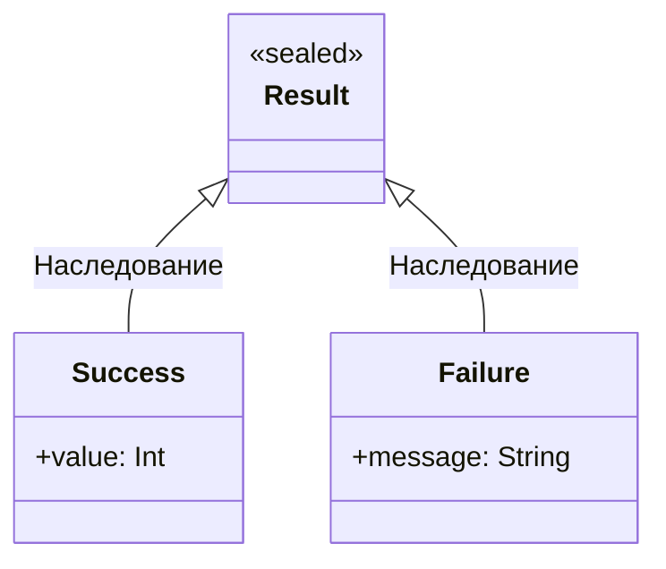
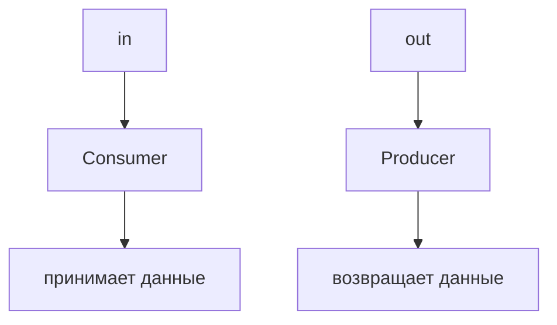

# Теория Kotlin: Часть 5

## enum class

Иногда значение может находиться только в одном из нескольких 
заранее известных вариантов.

Например, направление:

```kotlin
enum class Direction {
    NORTH,
    SOUTH,
    WEST,
    EAST
}
```

Теперь переменная может содержать только одно из этих значений:

```kotlin
val direction = Direction.NORTH
```

Перечисление удобно использовать, когда множество возможных вариантов 
заранее известно и все варианты имеют одинаковую общую структуру.

### Использование enum с when

`enum class` особенно хорошо сочетается с `when`:

```kotlin
enum class Direction {
    NORTH,
    SOUTH,
    WEST,
    EAST
}

fun describe(direction: Direction): String {
    return when (direction) {
        Direction.NORTH -> "Север"
        Direction.SOUTH -> "Юг"
        Direction.WEST -> "Запад"
        Direction.EAST -> "Восток"
    }
}
```

В `when` можно обработать все значения перечисления.

### Свойства и методы `enum class`

Enum-элементы могут иметь дополнительные свойства:

```kotlin
enum class Direction(
    val shortName: String
) {
    NORTH("N"),
    SOUTH("S"),
    WEST("W"),
    EAST("E")
}
```

Теперь:

```kotlin
println(Direction.NORTH.shortName) // N
```

Enum также может содержать функции:

```kotlin
enum class Direction(
    val shortName: String
) {
    NORTH("N"),
    SOUTH("S"),
    WEST("W"),
    EAST("E");

    fun printInfo() {
        println("Direction: $shortName")
    }
}
```

## sealed class

`enum class` подходит, когда есть фиксированный набор значений одного типа.

Но иногда разные варианты должны хранить **разные данные**.

Например, результат операции может быть успешным или содержать ошибку:

```kotlin
sealed class Result

data class Success(
    val value: Int
) : Result()

data class Failure(
    val message: String
) : Result()
```

Теперь `Result` имеет ограниченную и заранее известную иерархию:



`sealed class` и `sealed interface` позволяют создавать контролируемые 
иерархии типов: прямые наследники известны компилятору в пределах 
соответствующего `package`/`module`, что особенно полезно вместе с `when`.

### sealed и when

```kotlin
fun handleResult(result: Result) {
    when (result) {
        is Success -> {
            println("Получено значение: ${result.value}")
        }

        is Failure -> {
            println("Ошибка: ${result.message}")
        }
    }
}
```

Здесь `when` знает все варианты `Result`.

Это одно из главных преимуществ `sealed`.

Вместо:

```kotlin
else -> ...
```

можно обработать все известные варианты явно.

Если позже появится новый прямой наследник, компилятор сможет 
сообщить, что `when` больше не покрывает все случаи.

## sealed interface

Ограниченную иерархию можно построить и с помощью интерфейса:

```kotlin
sealed interface Result

data class Success(
    val value: Int
) : Result

data class Failure(
    val message: String
) : Result
```

Основная идея та же:


`sealed interface` особенно удобно, когда тип должен быть интерфейсом 
и при этом иметь конечный набор реализаций.

## enum или sealed?

Упрощённо:

| Ситуация                                 | Использовать                        |
| ---------------------------------------- | ----------------------------------- |
| Фиксированный набор простых вариантов    | `enum class`                        |
| Варианты могут хранить разную информацию | `sealed class` / `sealed interface` |

Например:

```kotlin
enum class TrafficLight {
    RED,
    YELLOW,
    GREEN
}
```

Но:

```kotlin
sealed class PaymentResult {
    data class Success(val transactionId: String) : PaymentResult()
    data class Failure(val reason: String) : PaymentResult()
}
```

Здесь варианты несут разную информацию, поэтому `sealed` подходит лучше.

## Nothing

Мы уже встречали `Unit`:

```kotlin
fun logMessage(message: String) {
    println(message)
}
```

Такая функция возвращает `Unit`.

Но существует ещё один специальный тип — `Nothing`.

`Nothing` обозначает значение, которого не существует.

Например, функция, которая всегда выбрасывает исключение:

```kotlin
fun fail(message: String): Nothing {
    throw IllegalStateException(message)
}
```

После вызова этой функции выполнение не продолжится обычным образом:

```kotlin
val name = "Alex"

if (name.isEmpty()) {
    fail("Имя пустое")
}

println(name)
```

`Nothing` также используется в функциях, которые никогда нормально 
не возвращают управление.

Важно различать:

- `Unit` - функция завершилась и не вернула полезного результата
- `Nothing` - функция не возвращает управление обычным способом

## Generics

Предположим, нам нужен контейнер, который может хранить значение.

Если писать отдельный класс для каждого типа:

```kotlin
class IntBox(
    val value: Int
)
```

```kotlin
class StringBox(
    val value: String
)
```

получается много повторяющегося кода.

`Generics` (Обобщения, дженерики) позволяют написать один класс:

```kotlin
class Box<T>(
    val value: T
)
```

`T` — параметр типа.

Теперь:

```kotlin
val intBox = Box(10)
val stringBox = Box("Kotlin")
```

**Kotlin** сам выводит:

- `intBox` - `Box<Int>`
- `stringBox` - `Box<String>`

`Generics` позволяют писать переиспользуемый код, который при этом сохраняет информацию о типах.

### Generic-функции

Параметры типа можно использовать и в функциях.

```kotlin
fun <T> printValue(value: T) {
    println(value)
}
```

Теперь функция работает с разными типами:

```kotlin
printValue(10)
printValue("Kotlin")
printValue(true)
```

Здесь `<T>` объявляет параметр типа.

### Как работает `T`

Рассмотрим:

```kotlin
fun <T> identity(value: T): T {
    return value
}
```

Функция принимает значение типа `T` и возвращает значение того же типа.

```kotlin
val number = identity(10)
val text = identity("Hello")
```

Получаем:

- `number` - `Int`
- `text` - `String`

Во многих случаях **Kotlin** самостоятельно выводит конкретное значение 
`T`, поэтому явно писать тип не требуется.

### Несколько параметров типа

У `generic`-класса может быть несколько параметров:

```kotlin
class PairBox<A, B>(
    val first: A,
    val second: B
)
```

Теперь:

```kotlin
val pair = PairBox(
    10,
    "Kotlin"
)
```

Получаем:

```text
PairBox<Int, String>
```

### Generics и коллекции

Мы уже много раз использовали конструкции вроде:

```kotlin
List<Int>
List<String>
Map<String, Int>
```

Это и есть `generics`.

Например:

```kotlin
val numbers: List<Int> = listOf(1, 2, 3)

val names: List<String> = listOf(
    "Alex",
    "Maria"
)
```

Здесь:

- `List<Int>` — означает список `Int`.
- `List<String>` — список `String`.

## Ограничения типа

Иногда нужно разрешить использовать только определённые типы.

Например:

```kotlin
fun <T : Number> printNumber(value: T) {
    println(value)
}
```

Теперь функция принимает всё, что наследует класс Number (все числовые типы):

```kotlin
printNumber(10)
printNumber(3.14)
```

Но:

```kotlin
// printNumber("Hello") // String не наследует Number
```

не скомпилируется.

После `:` задаётся **upper bound** — верхняя граница типа. 
**Kotlin** поддерживает ограничения `generic`-типа, чтобы ограничивать 
множество допустимых аргументов типа.

### Несколько ограничений

Можно задать несколько ограничений через `where`.

Например:

```kotlin
fun <T> compareValues(
    a: T,
    b: T
): Boolean
    where T : Number,
          T : Comparable<T> {

    return a == b
}
```

Такая запись позволяет потребовать от `T` наличие нескольких необходимых 
характеристик.

## in и out

У `generic`-типов есть важное свойство — `variance`.

Рассмотрим:

```kotlin
class Box<T>
```

Не следует автоматически считать:

```text
Box<String>
```

подтипом:

```text
Box<Any>
```

В **Kotlin** для управления таким поведением используются `in` и `out`.

### out

`out` означает, что тип в первую очередь **производится** объектом.

Например:

```kotlin
interface Producer<out T> {
    fun produce(): T
}
```

Теперь:

```kotlin
val strings: Producer<String> = ...
val objects: Producer<Any> = strings
```

Это допустимо.

Объект производит `String`, а любой `String` одновременно является `Any`.

Поэтому `Producer<String>` можно использовать там, где требуется `Producer<Any>`.

В **Kotlin** это называется **ковариантностью** (`covariance`).

Запомнить можно так:

`out` - отдаёт `T`

### in

`in` используется для типа, который в первую очередь **потребляет** значения.

```kotlin
interface Consumer<in T> {
    fun consume(value: T)
}
```

Например:

```kotlin
val consumer: Consumer<Any> = ...
```

Такой объект умеет принимать любое значение, в том числе `String`.

Поэтому его можно рассматривать как:

```kotlin
Consumer<String>
```

`in` называется **контравариантностью** (`contravariance`).

Запомнить можно:

`in` - принимает `T`
`out` - возвращает `T`

## Мнемоника `in` / `out`

Полезно запомнить:



Это особенно важно при проектировании `generic`-интерфейсов.

## Star projection *

Иногда конкретный параметр типа неизвестен или не важен.

Тогда используется `*`:

```kotlin
List<*>
```

Например:

```kotlin
val values: List<*> = listOf(
    1,
    "Hello",
    true
)
```

`List<*>` означает:

> список некоторого неизвестного типа.

Это не то же самое, что:

```kotlin
List<Any>
```

`List<Any>` означает:

> список, элементы которого имеют тип `Any`.

А:

```kotlin
List<*>
```

означает:

> список с неизвестным параметром типа.

Star projections являются безопасным способом работать с 
`generic`-типом, когда конкретный тип неизвестен.

На базовом уровне достаточно запомнить:

- `List<Any>` - явно `List Any`
- `List<*>` - тип элемента неизвестен

## reified

Обычно `generic`-типы стираются во время выполнения на **JVM**.

Из-за этого нельзя просто написать:

```kotlin
fun <T> printType(value: Any) {
    // if (value is T) { ... } // нельзя
}
```

Но **Kotlin** предоставляет специальный механизм `reified`.

Он используется вместе с `inline`:

```kotlin
inline fun <reified T> printType(value: Any) {
    if (value is T) {
        println("Это тип ${T::class.simpleName}")
    }
}
```

Теперь:

```kotlin
printType<String>("Kotlin")
printType<Int>(42)
```

`reified` позволяет использовать информацию о конкретном типе 
`T` внутри тела `inline`-функции в таких операциях, где обычный 
`generic`-параметр недоступен во время выполнения.

## object

В **Kotlin** есть специальная конструкция `object`.

Она позволяет объявить объект без отдельного вызова конструктора.

Например:

```kotlin
object Logger {
    fun log(message: String) {
        println("[LOG] $message")
    }
}
```

Использование:

```kotlin
Logger.log("Application started")
```

Мы не пишем:

```kotlin
Logger()
```

Потому что `Logger` уже представляет конкретный объект.

### object как Singleton

Одно из основных применений `object` — создание единственного объекта.

```kotlin
object Database {
    fun connect() {
        println("Connected")
    }
}
```

В рамках объявления такой объект представляет единственный экземпляр.

```kotlin
Database.connect()
Database.connect()
```

Обе операции обращаются к тому же объекту.

Инициализация `object`-declaration выполняется при первом обращении 
к нему и является потокобезопасной.

### Свойства object

`object` может содержать свойства:

```kotlin
object AppConfig {
    val appName = "My App"
    val version = "1.0"
}
```

Использование:

```kotlin
println(AppConfig.appName)
println(AppConfig.version)
```

### object и интерфейсы

Объект может реализовать интерфейс:

```kotlin
interface Logger {
    fun log(message: String)
}

object ConsoleLogger : Logger {
    override fun log(message: String) {
        println(message)
    }
}
```

Использование:

```kotlin
ConsoleLogger.log("Hello")
```

### Object expression

`object` может использоваться не только для singleton.

Можно создать **анонимный объект** непосредственно как выражение:

```kotlin
val logger = object {
    fun log(message: String) {
        println("[LOG] $message")
    }
}
```

Теперь:

```kotlin
logger.log("Hello")
```

Такой объект создаётся непосредственно в том месте, где он нужен.

`Object expressions` полезны, когда нужна одноразовая реализация 
класса или интерфейса без объявления отдельного именованного класса.

### Anonymous object с интерфейсом

Например:

```kotlin
interface ClickListener {
    fun onClick()
}
```

Можно создать реализацию:

```kotlin
val listener = object : ClickListener {
    override fun onClick() {
        println("Clicked!")
    }
}
```

Теперь:

```kotlin
listener.onClick()
```

Это удобно для одноразовых реализаций.

## companion object

В других языках часто существует понятие `static`.

Например, в **Java** можно написать:

```java
Math.max(10, 20);
```

В **Kotlin** ключевого слова `static` нет.

Вместо него часто используется `companion object`.

```kotlin
class MathUtils {
    companion object {
        fun max(a: Int, b: Int): Int {
            return if (a > b) a else b
        }
    }
}
```

Теперь:

```kotlin
MathUtils.max(10, 20)
```

### Что такое companion object

`companion object` — это объект, объявленный внутри класса, 
члены которого удобно использовать через имя класса.

Например:

```kotlin
class User private constructor(
    val name: String
) {
    companion object {
        fun create(name: String): User {
            return User(name)
        }
    }
}
```

Теперь:

```kotlin
val user = User.create("Alex")
```

Это один из распространённых вариантов реализации фабричного метода.

### Именованный companion object

`companion object` может иметь имя:

```kotlin
class User {
    companion object Factory {
        fun create(): User {
            return User()
        }
    }
}
```

Можно обратиться к нему через имя:

```kotlin
User.Factory.create()
```

Но в большинстве случаев имя не требуется:

```kotlin
class User {
    companion object {
        fun create(): User {
            return User()
        }
    }
}
```

Тогда:

```kotlin
User.create()
```

### companion object — это не настоящий static

На уровне синтаксиса `companion object` **Kotlin**:

```kotlin
User.create()
```

похож на `static` **Java**:

```java
User.create();
```

Но модель **Kotlin** отличается.

`companion object` — это объект, то есть экземпляр singleton-типа внутри класса.

Он может:

* иметь свойства;
* иметь функции;
* реализовывать интерфейсы;
* хранить состояние.

На **JVM** при необходимости можно использовать `@JvmStatic`, чтобы 
соответствующие члены были доступны **Java**-коду как статические методы/поля, 
но это уже вопрос **Kotlin/Java** interoperability.

### Константы в companion object

Часто `companion object` используется для хранения констант:

```kotlin
class HttpClient {
    companion object {
        const val DEFAULT_TIMEOUT = 5000
    }
}
```

Использование:

```kotlin
println(HttpClient.DEFAULT_TIMEOUT)
```

`const val` подходит для compile-time констант ограниченного набора 
типов и может использоваться на уровне файла или в `object`/`companion object`.

## Перегрузка операторов

**Kotlin** позволяет определить поведение некоторых операторов для собственных типов.

Например:

```kotlin
data class Point(
    val x: Int,
    val y: Int
)
```

Можно определить сложение двух точек:

```kotlin
operator fun Point.plus(other: Point): Point {
    return Point(
        x + other.x,
        y + other.y
    )
}
```

Теперь работает:

```kotlin
val a = Point(1, 2)
val b = Point(3, 4)

val c = a + b

println(c)
```

Получим:

```text
Point(x=4, y=6)
```

Чтобы перегрузить оператор, соответствующая функция объявляется 
с модификатором `operator`. **Kotlin** связывает символические операторы 
с определёнными именами функций по соглашениям языка.

### Операторы — это соглашения

В **Kotlin** многие операторы фактически представляют вызовы определённых функций.

Например:

```kotlin
a + b
```

соответствует:

```kotlin
a.plus(b)
```

А:

```kotlin
a - b
```

соответствует:

```kotlin
a.minus(b)
```

### Основные операторные соглашения

Некоторые распространённые соответствия:

| Оператор       | Функция        |
| -------------- | -------------- |
| `a + b`        | `plus()`       |
| `a - b`        | `minus()`      |
| `a * b`        | `times()`      |
| `a / b`        | `div()`        |
| `a % b`        | `rem()`        |
| `-a`           | `unaryMinus()` |
| `+a`           | `unaryPlus()`  |
| `!a`           | `not()`        |
| `a == b`       | `equals()`     |
| `a > b`        | `compareTo()`  |
| `a < b`        | `compareTo()`  |
| `a[i]`         | `get()`        |
| `a[i] = value` | `set()`        |
| `value in a`   | `contains()`   |
| `a()`          | `invoke()`     |

Операторные выражения определяются набором языковых соглашений, а не произвольным переопределением любых символов. Например, `===` и `!==` перегружать нельзя.

### Оператор []

Оператор доступа по индексу можно определить с помощью `get()`.

Например:

```kotlin
class Matrix(
    private val values: Array<IntArray>
) {
    operator fun get(row: Int, column: Int): Int {
        return values[row][column]
    }
}
```

Теперь:

```kotlin
val matrix = Matrix(
    arrayOf(
        intArrayOf(1, 2),
        intArrayOf(3, 4)
    )
)

println(matrix[0, 1]) // 2
```

Конструкция:

```kotlin
matrix[0, 1]
```

использует операторное соглашение `get()`.

### Оператор invoke

Можно определить, как объект ведёт себя при вызове как функция.

```kotlin
class Greeter {
    operator fun invoke(name: String) {
        println("Hello, $name!")
    }
}
```

Теперь:

```kotlin
val greeter = Greeter()

greeter("Alex")
```

Вызов:

```kotlin
greeter("Alex")
```

использует:

```kotlin
greeter.invoke("Alex")
```

Это мощная конструкция, но использовать её стоит осознанно — 
объект должен действительно логично восприниматься как вызываемое действие.

## Infix functions

**Kotlin** также позволяет объявлять некоторые функции как `infix`.

Например:

```kotlin
infix fun Int.timesText(text: String): String {
    return text.repeat(this)
}
```

Теперь:

```kotlin
val result = 3 timesText "Hi"

println(result)
```

Результат:

```text
HiHiHi
```

`infix` использует другой синтаксис вызова, но не означает автоматическую 
перегрузку символического оператора.

В реальном коде `infix`-функции лучше применять там, где такой синтаксис 
действительно делает выражение понятнее.

## Делегирование

**Kotlin** позволяет передавать реализацию одного объекта другому.

Это называется **делегированием**.

Предположим, есть интерфейс:

```kotlin
interface Printer {
    fun print()
}
```

Есть реализация:

```kotlin
class ConsolePrinter : Printer {
    override fun print() {
        println("Printing...")
    }
}
```

Другой класс может делегировать реализацию интерфейсу:

```kotlin
class Document(
    private val printer: Printer
) : Printer by printer
```

Теперь:

```kotlin
val document = Document(
    ConsolePrinter()
)

document.print()
```

`Document` не реализует `print()` самостоятельно — вызов передаётся объекту `printer`.

### Почему делегирование полезно

Без делегирования пришлось бы писать:

```kotlin
class Document(
    private val printer: Printer
) : Printer {

    override fun print() {
        printer.print()
    }
}
```

С `by`:

```kotlin
class Document(
    private val printer: Printer
) : Printer by printer
```

**Kotlin** автоматически создаёт необходимую передачу вызовов.

Это позволяет повторно использовать поведение объектов без наследования 
от конкретного класса.

### Делегированные свойства

Ключевое слово `by` используется не только для классов, но и для свойств:

```kotlin
val name: String by delegate
```

Здесь другой объект отвечает за получение значения свойства.

Для этого используются специальные операторные функции, например:

```kotlin
operator fun getValue(...)
```

а для изменяемых свойств дополнительно:

```kotlin
operator fun setValue(...)
```

Делегированные свойства позволяют вынести логику хранения или получения 
значения в отдельный объект.

<iframe src="https://pl.kotl.in/1Bb8p4kaQ" height="530"></iframe>

### lazy

Один из часто встречающихся готовых делегатов — `lazy`.

```kotlin
val config by lazy {
    println("Инициализация")
    loadConfig()
}
```

Значение вычислится при первом обращении:

```kotlin
println(config)
```

После этого результат будет сохранён для дальнейших обращений.

`lazy` особенно полезен, когда создание объекта или вычисление 
значения дорого и не всегда необходимо.

<iframe src="https://pl.kotl.in/BVNoybcfA" height="380"></iframe>